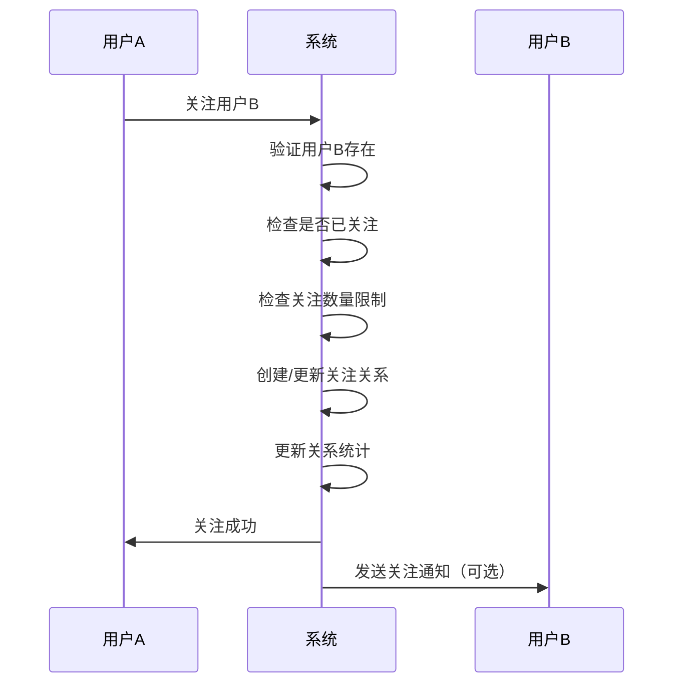
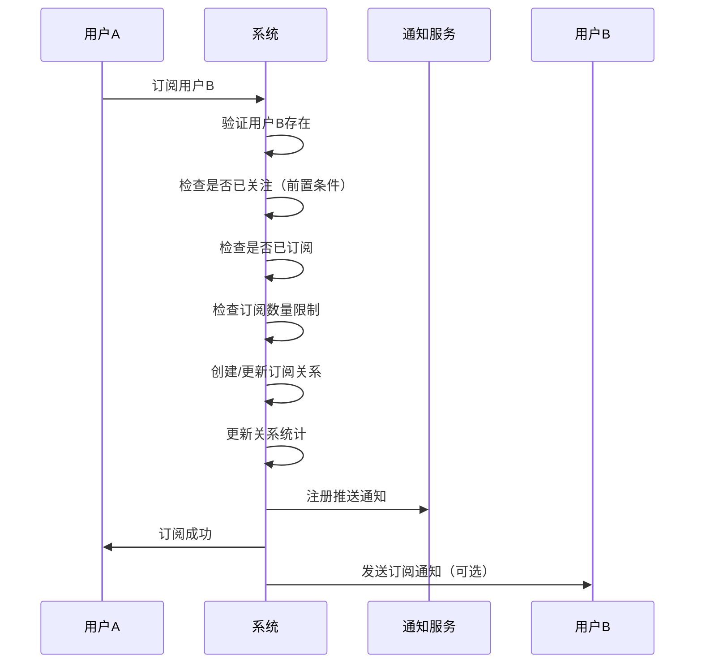
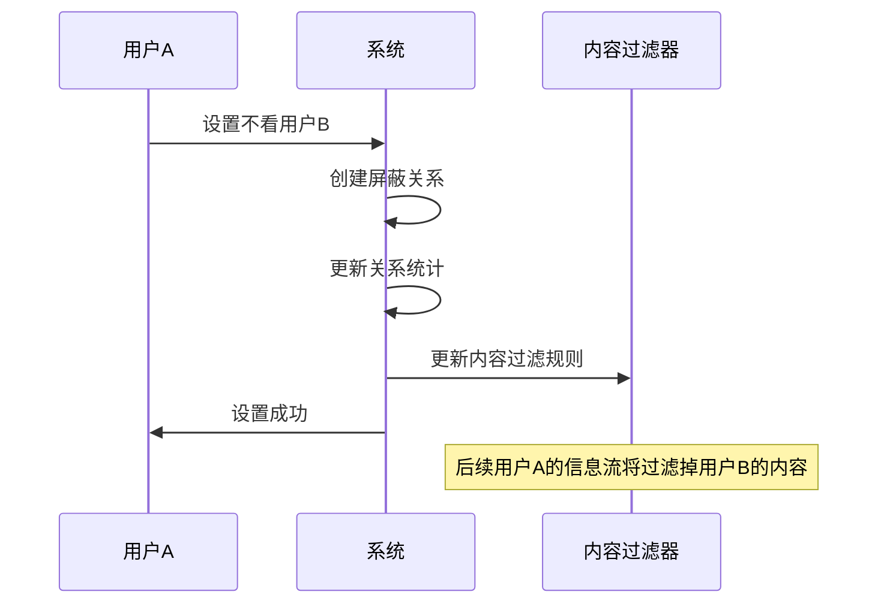
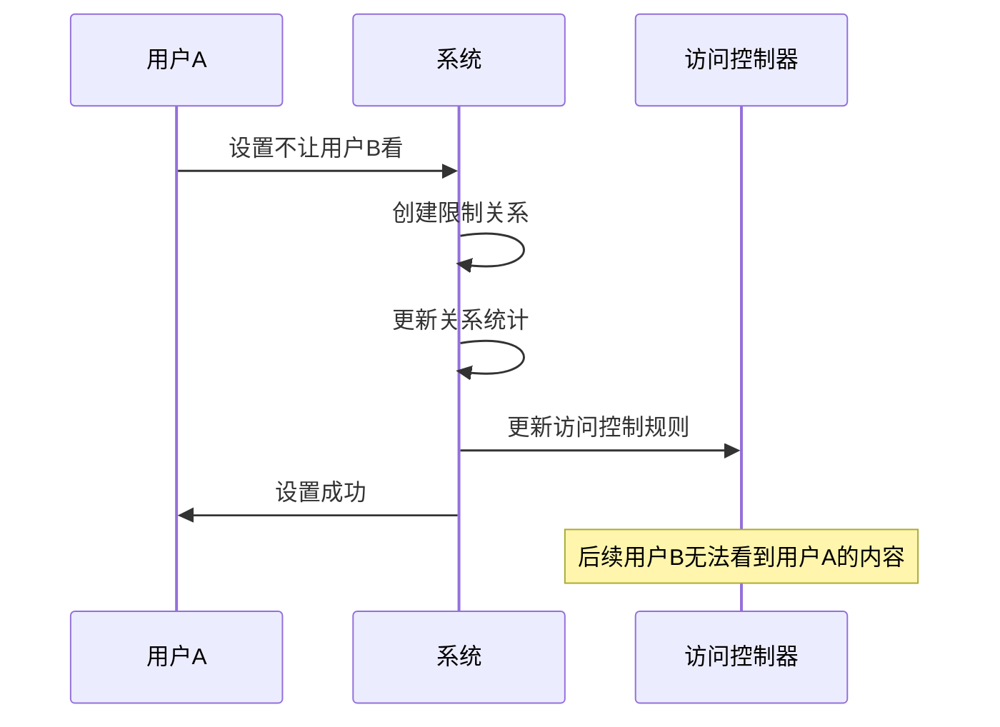
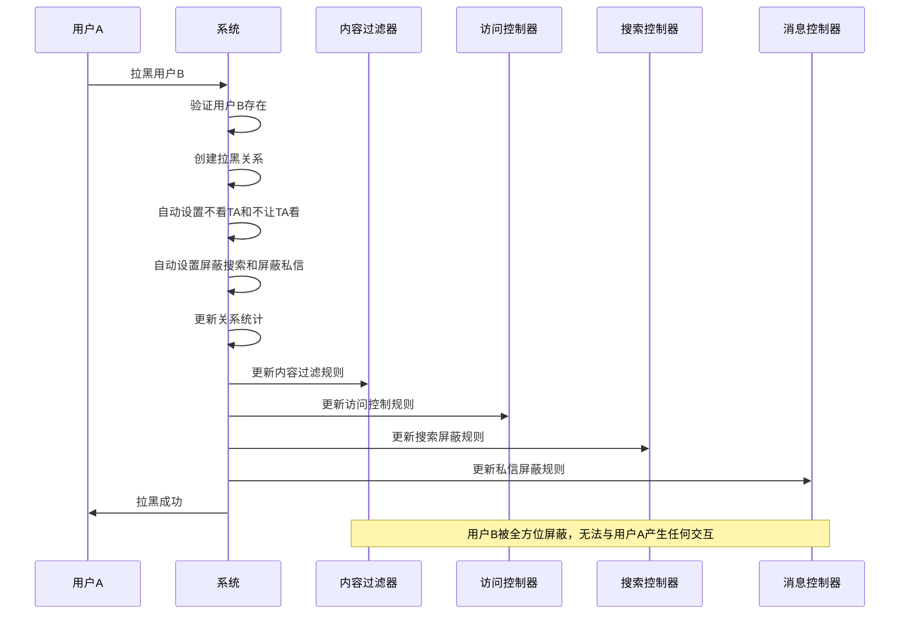
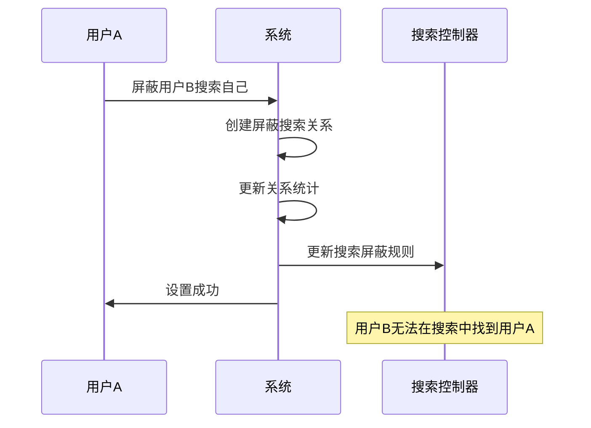
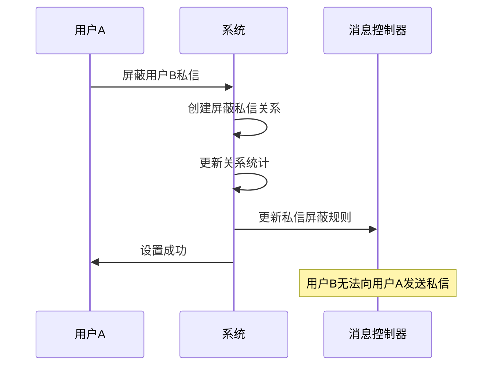

# 用户关系系统设计文档

## 1. 需求概述

### 1.1 背景
在内容社区系统中，用户之间的关系管理是核心功能之一。用户需要能够关注感兴趣的其他用户，同时也需要对不感兴趣或不希望看到的用户进行屏蔽管理。

### 1.2 目标
- 实现用户之间的关注功能
- 提供"不看TA"功能，屏蔽特定用户的内容
- 提供"不让TA看"功能，防止特定用户看到自己的内容
- 确保用户隐私和内容可见性的精确控制

### 1.3 适用范围
- 内容社区系统的所有注册用户
- 涵盖文章、帖子、视频、评论等所有内容类型

## 2. 功能需求

### 2.1 核心功能

#### 2.1.1 关注功能
- **功能描述**：用户可以关注其他用户，关注后可以优先看到被关注用户的内容
- **业务规则**：
  - 用户不能关注自己
  - 关注关系是单向的（A关注B，不代表B关注A）
  - 支持取消关注
  - 关注数量可设置上限（建议5000）

#### 2.1.2 订阅功能（特别关注）
- **功能描述**：用户在关注的基础上可以进一步订阅对方，订阅后会收到更及时的内容推送通知
- **业务规则**：
  - 订阅必须基于关注关系（先关注才能订阅）
  - 订阅关系是单向的
  - 支持取消订阅但保持关注
  - 订阅用户的内容会优先推送
  - 订阅数量建议限制在关注数的10%以内

#### 2.1.3 不看TA功能
- **功能描述**：用户可以设置不看某个用户的内容，被屏蔽用户的所有内容将不会出现在当前用户的信息流中
- **业务规则**：
  - 屏蔽后，被屏蔽用户的文章、帖子、视频、评论等内容不会出现在信息流中
  - 屏蔽关系是单向的
  - 支持取消屏蔽
  - 屏蔽不影响被屏蔽用户的正常使用

#### 2.1.4 不让TA看功能
- **功能描述**：用户可以设置不让某个用户看到自己的内容
- **业务规则**：
  - 被限制用户无法看到当前用户发布的任何内容
  - 限制关系是单向的
  - 支持取消限制
  - 被限制用户不会收到任何提示

#### 2.1.5 拉黑功能（完全屏蔽）
- **功能描述**：用户可以完全拉黑某个用户，实现全方位的屏蔽效果，包括内容屏蔽、搜索屏蔽、私信屏蔽等
- **业务规则**：
  - 拉黑后自动设置"不看TA"和"不让TA看"
  - 被拉黑用户无法在搜索中找到拉黑者
  - 被拉黑用户无法向拉黑者发送私信
  - 被拉黑用户无法@提及拉黑者
  - 拉黑关系是单向的，但影响是双向的
  - 支持取消拉黑，恢复正常关系
  - 拉黑操作对被拉黑用户不可见

#### 2.1.6 屏蔽搜索功能
- **功能描述**：用户可以设置屏蔽某个用户在搜索中找到自己
- **业务规则**：
  - 被屏蔽用户在搜索用户时无法找到屏蔽者
  - 屏蔽者仍可以搜索到被屏蔽用户（单向屏蔽）
  - 支持取消屏蔽搜索
  - 屏蔽搜索不影响其他功能

#### 2.1.7 屏蔽私信功能
- **功能描述**：用户可以设置屏蔽某个用户的私信消息
- **业务规则**：
  - 被屏蔽用户无法向屏蔽者发送私信
  - 被屏蔽用户发送的私信会被系统拦截
  - 屏蔽者不会收到任何私信通知
  - 支持取消屏蔽私信
  - 屏蔽私信不影响其他社交功能

### 2.2 辅助功能

#### 2.2.1 关系查询
- 查看关注列表
- 查看订阅列表
- 查看粉丝列表
- 查看订阅者列表
- 查看屏蔽列表（不看TA列表）
- 查看限制列表（不让TA看列表）
- 查看拉黑列表（完全屏蔽列表）
- 查看屏蔽搜索列表
- 查看屏蔽私信列表
- 查看互相关注列表
- 查看互相订阅列表

#### 2.2.2 批量操作
- 批量关注
- 批量订阅
- 批量取消关注
- 批量取消订阅
- 批量屏蔽（不看TA）
- 批量取消屏蔽
- 批量拉黑
- 批量取消拉黑
- 批量屏蔽搜索
- 批量屏蔽私信

## 3. 数据模型设计

### 3.1 用户关系表（user_relation）

```sql
CREATE TABLE user_relation (
    id VARCHAR(32) NOT NULL COMMENT '主键ID',
    user_id VARCHAR(32) NOT NULL COMMENT '用户ID',
    target_user_id VARCHAR(32) NOT NULL COMMENT '目标用户ID',
    is_follow TINYINT(1) DEFAULT 0 COMMENT '是否关注：1-关注，0-未关注',
    is_subscribe TINYINT(1) DEFAULT 0 COMMENT '是否订阅：1-订阅，0-未订阅（特别关注）',
    is_block_view TINYINT(1) DEFAULT 0 COMMENT '是否不看TA：1-屏蔽，0-未屏蔽',
    is_block_viewed TINYINT(1) DEFAULT 0 COMMENT '是否不让TA看：1-限制，0-未限制',
    is_block_search TINYINT(1) DEFAULT 0 COMMENT '是否屏蔽搜索：1-屏蔽，0-未屏蔽',
    is_block_message TINYINT(1) DEFAULT 0 COMMENT '是否屏蔽私信：1-屏蔽，0-未屏蔽',
    create_by VARCHAR(50) COMMENT '创建人',
    create_time DATETIME COMMENT '创建时间',
    update_by VARCHAR(50) COMMENT '更新人',
    update_time DATETIME COMMENT '更新时间',
    del_flag INTEGER DEFAULT 0 COMMENT '删除标志：0-正常，1-删除',
    PRIMARY KEY (id),
    UNIQUE KEY uk_user_target (user_id, target_user_id),
    KEY idx_user_id (user_id),
    KEY idx_target_user_id (target_user_id),
    KEY idx_follow (is_follow),
    KEY idx_subscribe (is_subscribe),
    KEY idx_block_view (is_block_view),
    KEY idx_block_viewed (is_block_viewed),
    KEY idx_block_search (is_block_search),
    KEY idx_block_message (is_block_message)
) COMMENT='用户关系表（注：拉黑为组合操作，会同时设置不看TA/不让TA看/屏蔽搜索/屏蔽私信等多个字段，数据库不单独存储 is_block 字段）';
```

**设计优势说明：**
1. **存储效率**：使用7个TINYINT(1)字段，每个字段只占1字节，相比INTEGER的4字节，大幅节省了存储空间
2. **查询性能**：每个关系类型都有独立索引，查询特定关系类型时性能更好
3. **业务灵活性**：支持用户对同一目标用户同时设置多种关系（如既关注又订阅，或既关注又屏蔽某些内容）
4. **扩展性**：后续增加新的关系类型只需添加新字段，不需要修改现有数据
5. **数据一致性**：使用唯一约束确保每对用户只有一条关系记录
6. **订阅机制**：订阅功能基于关注功能，提供更精细的内容推送控制
7. **拉黑功能**：支持完全拉黑，自动设置多种屏蔽关系，提供最强的隔离效果
8. **细粒度控制**：支持独立控制搜索屏蔽和私信屏蔽，满足不同场景需求

### 3.2 关系类型枚举

```java
/**
 * 关系类型枚举说明
 * 注意：Block（拉黑）为组合操作，不对应单独字段；
 * 实现时需同时设置不看TA、不让TA看、屏蔽搜索、屏蔽私信等多个标志位。
 */
public enum RelationTypeEnum {
    FOLLOW("is_follow", "关注"),
    SUBSCRIBE("is_subscribe", "订阅"),
    BLOCK_VIEW("is_block_view", "不看TA"),
    BLOCK_VIEWED("is_block_viewed", "不让TA看"),
    BLOCK_SEARCH("is_block_search", "屏蔽搜索"),
    BLOCK_MESSAGE("is_block_message", "屏蔽私信");
    
    private final String fieldName;
    private final String desc;
    
    RelationTypeEnum(String fieldName, String desc) {
        this.fieldName = fieldName;
        this.desc = desc;
    }
    
    public String getFieldName() {
        return fieldName;
    }
    
    public String getDesc() {
        return desc;
    }
}
```

补充说明：
- 拉黑（BLOCK）为原子组合操作，等价于：不看TA=1、不让TA看=1、屏蔽搜索=1、屏蔽私信=1。
- 取消拉黑等价于将上述四个标志位恢复为0。

### 3.3 用户关系统计表（user_relation_stats）

```sql
CREATE TABLE user_relation_stats (
    id VARCHAR(32) NOT NULL COMMENT '主键ID',
    user_id VARCHAR(32) NOT NULL COMMENT '用户ID',
    follow_count INTEGER DEFAULT 0 COMMENT '关注数',
    subscribe_count INTEGER DEFAULT 0 COMMENT '订阅数',
    fans_count INTEGER DEFAULT 0 COMMENT '粉丝数',
    subscribers_count INTEGER DEFAULT 0 COMMENT '订阅者数',
    block_view_count INTEGER DEFAULT 0 COMMENT '屏蔽数（不看TA）',
    block_viewed_count INTEGER DEFAULT 0 COMMENT '被限制数（不让TA看）',
    block_count INTEGER DEFAULT 0 COMMENT '拉黑数',
    blocked_count INTEGER DEFAULT 0 COMMENT '被拉黑数',
    block_search_count INTEGER DEFAULT 0 COMMENT '屏蔽搜索数',
    block_message_count INTEGER DEFAULT 0 COMMENT '屏蔽私信数',
    create_by VARCHAR(50) COMMENT '创建人',
    create_time DATETIME COMMENT '创建时间',
    update_by VARCHAR(50) COMMENT '更新人',
    update_time DATETIME COMMENT '更新时间',
    del_flag INTEGER DEFAULT 0 COMMENT '删除标志：0-正常，1-删除',
    PRIMARY KEY (id),
    UNIQUE KEY uk_user_id (user_id)
) COMMENT='用户关系统计表';
```

## 4. 业务逻辑设计

### 4.1 关注流程



### 4.2 订阅流程



### 4.3 不看TA流程



### 4.4 不让TA看流程



### 4.5 拉黑流程



### 4.6 屏蔽搜索流程



### 4.7 屏蔽私信流程



### 4.8 内容可见性判断逻辑

```java
/**
 * 判断内容是否对用户可见
 * @param contentUserId 内容发布者ID
 * @param viewerUserId 查看者ID
 * @return 是否可见
 */
public boolean isContentVisible(String contentUserId, String viewerUserId) {
    // 自己的内容总是可见
    if (contentUserId.equals(viewerUserId)) {
        return true;
    }
    
    // 查询用户关系
    UserRelation relation = getUserRelation(contentUserId, viewerUserId);
    if (relation != null) {
        // 检查发布者是否对查看者执行了“拉黑组合”（完全屏蔽）：不让TA看 或 其他组合造成不可见
        // 组合判断：不让TA看为强不可见条件；另外若存在其他组合（例如审计策略），可在此扩展
        if (relation.getIsBlockViewed() == 1) {
            return false;
        }
        // 检查发布者是否设置了不让查看者看
        if (relation.getIsBlockViewed() == 1) {
            return false;
        }
    }
    
    // 查询查看者对发布者的关系
    UserRelation viewerRelation = getUserRelation(viewerUserId, contentUserId);
    if (viewerRelation != null) {
        // 检查查看者是否对发布者执行了“拉黑组合”（完全屏蔽）：不看TA 或 其他组合造成不可见
        if (viewerRelation.getIsBlockView() == 1) {
            return false;
        }
        // 检查查看者是否设置了不看发布者
        if (viewerRelation.getIsBlockView() == 1) {
            return false;
        }
    }
    
    return true;
}

/**
 * 判断用户是否可以搜索到目标用户
 * @param searchUserId 搜索者ID
 * @param targetUserId 目标用户ID
 * @return 是否可以搜索到
 */
public boolean isUserSearchable(String searchUserId, String targetUserId) {
    // 自己总是可以搜索到
    if (searchUserId.equals(targetUserId)) {
        return true;
    }
    
    // 查询目标用户对搜索者的关系
    UserRelation relation = getUserRelation(targetUserId, searchUserId);
    if (relation != null) {
        // 检查目标用户是否对搜索者执行了“拉黑组合”（完全屏蔽）：屏蔽搜索或其他组合造成不可搜索
        if (relation.getIsBlockSearch() == 1) {
            return false;
        }
        // 检查目标用户是否屏蔽了搜索者的搜索
        if (relation.getIsBlockSearch() == 1) {
            return false;
        }
    }
    
    return true;
}

/**
 * 判断用户是否可以发送私信
 * @param senderId 发送者ID
 * @param receiverId 接收者ID
 * @return 是否可以发送私信
 */
public boolean canSendPrivateMessage(String senderId, String receiverId) {
    // 不能给自己发私信
    if (senderId.equals(receiverId)) {
        return false;
    }
    
    // 查询接收者对发送者的关系
    UserRelation relation = getUserRelation(receiverId, senderId);
    if (relation != null) {
        // 检查接收者是否对发送者执行了“拉黑组合”（完全屏蔽）：屏蔽私信或其他组合造成不可发送
        if (relation.getIsBlockMessage() == 1) {
            return false;
        }
        // 检查接收者是否屏蔽了发送者的私信
        if (relation.getIsBlockMessage() == 1) {
            return false;
        }
    }
    
    return true;
}

/**
 * 获取用户关系
 * @param userId 用户ID
 * @param targetUserId 目标用户ID
 * @return 用户关系对象
 */
private UserRelation getUserRelation(String userId, String targetUserId) {
    // 从缓存或数据库获取关系数据
    return userRelationMapper.selectOne(
        new QueryWrapper<UserRelation>()
            .eq("user_id", userId)
            .eq("target_user_id", targetUserId)
            .eq("del_flag", 0)
    );
}
```

## 5. API接口设计

### 5.1 关注相关接口

#### 5.1.1 关注用户
```http
POST /api/user/relation/follow
Content-Type: application/json

{
    "targetUserId": "目标用户ID"
}
```

#### 5.1.2 取消关注
```http
DELETE /api/user/relation/follow/{targetUserId}
```

#### 5.1.3 订阅用户
```http
POST /api/user/relation/subscribe
Content-Type: application/json

{
    "targetUserId": "目标用户ID"
}
```

#### 5.1.4 取消订阅
```http
DELETE /api/user/relation/subscribe/{targetUserId}
```

#### 5.1.5 获取关注列表
```http
GET /api/user/relation/follow/list?pageNo=1&pageSize=20
```

#### 5.1.6 获取订阅列表
```http
GET /api/user/relation/subscribe/list?pageNo=1&pageSize=20
```

#### 5.1.7 获取粉丝列表
```http
GET /api/user/relation/fans/list?pageNo=1&pageSize=20
```

#### 5.1.8 获取订阅者列表
```http
GET /api/user/relation/subscribers/list?pageNo=1&pageSize=20
```

### 5.2 屏蔽相关接口

#### 5.2.1 设置不看TA
```http
POST /api/user/relation/block-view
Content-Type: application/json

{
    "targetUserId": "目标用户ID"
}
```

#### 5.2.2 取消不看TA
```http
DELETE /api/user/relation/block-view/{targetUserId}
```

#### 5.2.3 设置不让TA看
```http
POST /api/user/relation/block-viewed
Content-Type: application/json

{
    "targetUserId": "目标用户ID"
}
```

#### 5.2.4 取消不让TA看
```http
DELETE /api/user/relation/block-viewed/{targetUserId}
```

### 5.3 拉黑相关接口

#### 5.3.1 拉黑用户（完全屏蔽）
```http
POST /api/user/relation/block
Content-Type: application/json

{
    "targetUserId": "目标用户ID"
}
```

#### 5.3.2 取消拉黑
```http
DELETE /api/user/relation/block/{targetUserId}
```

#### 5.3.3 屏蔽搜索
```http
POST /api/user/relation/block-search
Content-Type: application/json

{
    "targetUserId": "目标用户ID"
}
```

#### 5.3.4 取消屏蔽搜索
```http
DELETE /api/user/relation/block-search/{targetUserId}
```

#### 5.3.5 屏蔽私信
```http
POST /api/user/relation/block-message
Content-Type: application/json

{
    "targetUserId": "目标用户ID"
}
```

#### 5.3.6 取消屏蔽私信
```http
DELETE /api/user/relation/block-message/{targetUserId}
```

### 5.4 查询相关接口

#### 5.4.1 获取用户关系统计
```http
GET /api/user/relation/stats/{userId}
```

#### 5.4.2 检查关系状态
```http
GET /api/user/relation/check?targetUserId={targetUserId}
```

#### 5.4.3 获取拉黑列表
```http
GET /api/user/relation/block/list?pageNo=1&pageSize=20
```

#### 5.4.4 获取屏蔽搜索列表
```http
GET /api/user/relation/block-search/list?pageNo=1&pageSize=20
```

#### 5.4.5 获取屏蔽私信列表
```http
GET /api/user/relation/block-message/list?pageNo=1&pageSize=20
```

### 5.5 批量操作接口

#### 5.5.1 批量拉黑
```http
POST /api/user/relation/block/batch
Content-Type: application/json

{
    "targetUserIds": ["用户ID1", "用户ID2", "用户ID3"]
}
```

#### 5.5.2 批量取消拉黑
```http
DELETE /api/user/relation/block/batch
Content-Type: application/json

{
    "targetUserIds": ["用户ID1", "用户ID2", "用户ID3"]
}
```

#### 5.5.3 批量屏蔽搜索
```http
POST /api/user/relation/block-search/batch
Content-Type: application/json

{
    "targetUserIds": ["用户ID1", "用户ID2", "用户ID3"]
}
```

#### 5.5.4 批量屏蔽私信
```http
POST /api/user/relation/block-message/batch
Content-Type: application/json

{
    "targetUserIds": ["用户ID1", "用户ID2", "用户ID3"]
}
```

## 6. 权限控制

### 6.1 接口权限
- 所有用户关系接口需要用户登录
- 用户只能管理自己的关系
- 管理员可以查看所有用户关系（用于管理目的）

### 6.2 数据权限
- 用户只能查看自己的关注列表、屏蔽列表等
- 粉丝列表根据隐私设置决定是否公开
- 屏蔽和限制关系对被操作用户不可见

## 7. 性能优化

### 7.1 数据库优化
- **索引优化**：为高频查询字段建立复合索引
- **分表策略**：当用户关系数据量过大时，可按用户ID哈希分表
- **缓存策略**：热点用户关系数据缓存到Redis
- **读写分离**：关系查询使用读库，关系变更使用写库

### 7.2 缓存策略
- **用户关系缓存**：缓存用户的关注、订阅、屏蔽关系
- **统计数据缓存**：缓存用户的关注数、粉丝数、订阅数等统计信息
- **内容可见性缓存**：缓存内容对特定用户的可见性结果
- **缓存更新策略**：关系变更时及时更新相关缓存

### 7.3 查询优化
- **批量查询**：支持批量获取多个用户的关系状态
- **分页优化**：大列表查询使用游标分页提升性能
- **预加载策略**：关键页面预加载用户关系数据
- **异步处理**：非核心关系操作异步处理，提升响应速度

### 7.4 订阅推送优化
- **推送队列**：使用消息队列处理订阅内容推送
- **推送限流**：防止单个用户发布过多内容造成推送风暴
- **智能推送**：根据用户活跃度和内容质量智能推送
- **推送去重**：避免重复推送相同内容给订阅用户

## 8. 安全考虑

### 8.1 防刷机制
- 关注/取消关注操作限制频率（每分钟最多10次）
- 订阅/取消订阅操作限制频率（每分钟最多5次）
- 屏蔽操作限制频率（每分钟最多5次）
- 拉黑操作限制频率（每分钟最多3次）
- 批量操作限制（每次最多操作50个用户）
- 使用验证码防止批量操作

### 8.2 隐私保护
- 屏蔽和限制关系对被操作用户不可见
- 拉黑关系完全隐藏，被拉黑用户无法感知
- 关系列表根据隐私设置控制可见性
- 订阅关系可设置为私密，不对外展示
- 搜索屏蔽确保用户隐私不被侵犯

### 8.3 数据安全
- 敏感操作记录日志用于审计
- 拉黑操作需要记录详细日志，包括操作原因
- 关系数据定期备份
- 防止数据泄露和恶意访问
- 私信屏蔽确保用户不受骚扰

## 9. 监控告警

### 9.1 关键指标监控
- **关系操作QPS**：监控关注、订阅、屏蔽操作的每秒请求数
- **关系数据量**：监控用户关系表的数据增长趋势
- **缓存命中率**：监控Redis缓存的命中率和性能
- **接口响应时间**：监控各个关系接口的响应时间
- **订阅推送成功率**：监控订阅内容推送的成功率

### 9.2 异常告警
- **频繁操作告警**：检测异常频繁的关注/取消关注行为
- **大量屏蔽告警**：检测用户被大量屏蔽的异常情况
- **系统异常告警**：数据库连接异常、缓存异常等系统级告警
- **推送失败告警**：订阅推送失败率超过阈值时告警

### 9.3 数据统计
- **日活跃用户关系操作统计**：统计每日用户关系操作活跃度
- **关系类型分布统计**：统计各种关系类型的分布情况
- **订阅转化率统计**：统计关注到订阅的转化率
- **用户行为分析**：分析用户关系操作的行为模式

## 10. 测试用例

### 10.1 关注功能测试
- **正常关注**：用户A关注用户B，验证关系创建成功
- **重复关注**：用户A重复关注用户B，验证幂等性
- **关注不存在用户**：关注不存在的用户，验证错误处理
- **关注数量限制**：验证关注数量达到上限时的处理
- **取消关注**：验证取消关注功能正常

### 10.2 订阅功能测试
- **正常订阅**：用户A关注用户B后订阅，验证订阅成功
- **未关注直接订阅**：验证未关注情况下无法订阅
- **重复订阅**：验证重复订阅的幂等性
- **订阅数量限制**：验证订阅数量达到上限时的处理
- **取消订阅**：验证取消订阅后仍保持关注关系
- **订阅推送**：验证订阅用户发布内容时的推送功能

### 10.3 屏蔽功能测试
- **不看TA功能**：验证屏蔽后不再看到对方内容
- **不让TA看功能**：验证屏蔽后对方无法看到自己内容
- **双向屏蔽**：验证同时设置两种屏蔽的效果
- **屏蔽后关注**：验证屏蔽关系对关注功能的影响

### 10.4 拉黑功能测试
- **完全拉黑**：验证拉黑后的完全屏蔽效果
- **拉黑后内容不可见**：验证拉黑用户的内容完全不可见
- **拉黑后无法搜索**：验证被拉黑用户无法搜索到拉黑者
- **拉黑后无法私信**：验证被拉黑用户无法发送私信
- **取消拉黑**：验证取消拉黑后关系恢复正常
- **批量拉黑**：验证批量拉黑操作的正确性

### 10.5 搜索屏蔽测试
- **屏蔽搜索功能**：验证屏蔽后对方无法搜索到自己
- **搜索结果过滤**：验证搜索结果正确过滤被屏蔽用户
- **取消屏蔽搜索**：验证取消后搜索功能恢复

### 10.6 私信屏蔽测试
- **屏蔽私信功能**：验证屏蔽后对方无法发送私信
- **私信发送失败**：验证被屏蔽用户发送私信失败
- **取消屏蔽私信**：验证取消后私信功能恢复

### 10.7 关系查询测试
- **关注列表查询**：验证分页查询关注列表
- **订阅列表查询**：验证分页查询订阅列表
- **粉丝列表查询**：验证分页查询粉丝列表
- **订阅者列表查询**：验证分页查询订阅者列表
- **拉黑列表查询**：验证分页查询拉黑列表
- **屏蔽搜索列表查询**：验证分页查询屏蔽搜索列表
- **屏蔽私信列表查询**：验证分页查询屏蔽私信列表
- **关系状态查询**：验证查询两用户间的关系状态

### 10.8 性能测试
- **并发关注测试**：测试高并发关注操作的性能
- **大数据量查询**：测试大量关系数据的查询性能
- **缓存性能测试**：测试缓存命中率和响应时间
- **订阅推送性能**：测试大量订阅用户的推送性能

### 10.6 安全测试
- **频率限制测试**：验证操作频率限制功能
- **权限验证测试**：验证用户只能操作自己的关系
- **数据隔离测试**：验证用户间数据隔离
- **恶意操作防护**：测试对恶意批量操作的防护

## 11. 部署说明

### 11.1 数据库变更
- 执行数据库脚本创建相关表
- 为现有用户初始化统计数据

### 11.2 配置变更
- 添加关系相关配置参数
- 配置Redis缓存参数
- 配置异步任务参数

### 11.3 上线步骤
1. 部署数据库变更
2. 部署后端代码
3. 部署前端代码
4. 验证功能正常
5. 监控系统运行状态

## 12. 后续优化方向

### 12.1 功能扩展
- **智能推荐**：基于用户关系和行为数据推荐可能感兴趣的用户
- **关系标签**：支持给关注的用户添加自定义标签分类
- **订阅分组**：支持将订阅用户分组管理，不同分组设置不同推送策略
- **关系强度**：根据互动频率计算用户间关系强度
- **社交图谱**：构建用户社交关系图谱，支持复杂关系查询

### 12.2 性能优化
- **图数据库**：考虑使用Neo4j等图数据库存储复杂关系网络
- **分布式缓存**：使用分布式缓存提升大规模用户关系查询性能
- **异步处理**：更多操作异步化，提升系统响应速度
- **数据预计算**：预计算热门用户的关系数据，提升查询效率

### 12.3 算法优化
- **推送算法**：基于用户活跃度和内容质量优化订阅推送算法
- **反垃圾算法**：识别和防范恶意关注、订阅行为
- **个性化算法**：根据用户偏好个性化推荐关注对象
- **社区发现**：基于关系网络发现用户社区和兴趣圈子

### 12.4 数据分析
- **关系分析**：分析用户关系网络的特征和演化趋势
- **行为分析**：分析用户关注、订阅行为模式
- **影响力分析**：计算用户在关系网络中的影响力指标
- **推荐效果分析**：分析关注推荐的准确率和用户满意度

---

**文档版本**：v1.0  
**创建时间**：2024年12月  
**最后更新**：2024年12月  
**负责人**：开发团队