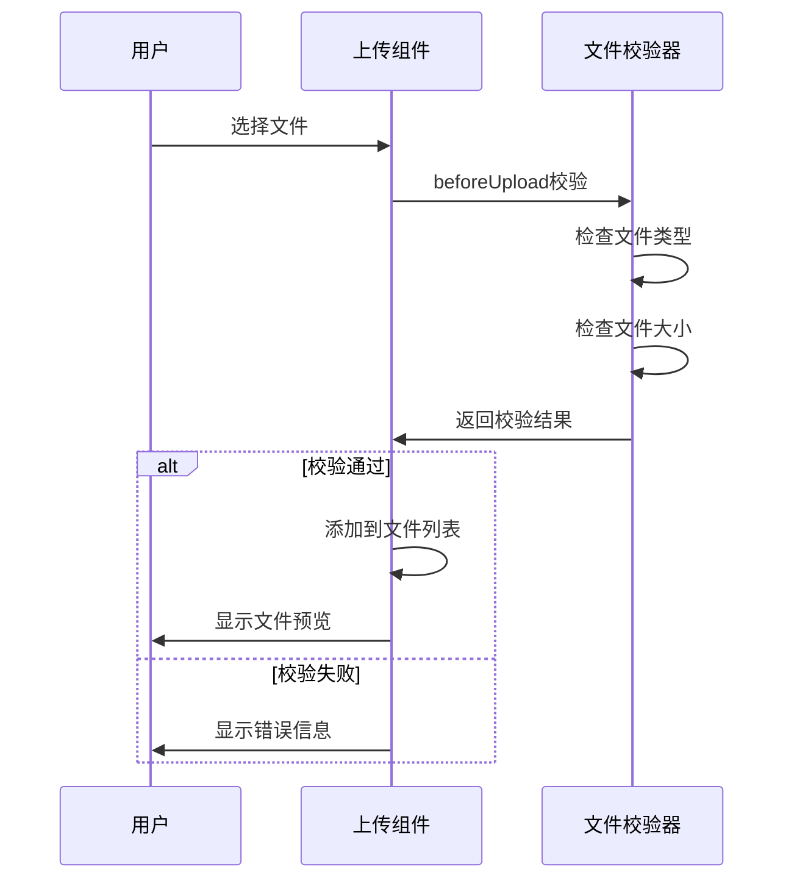
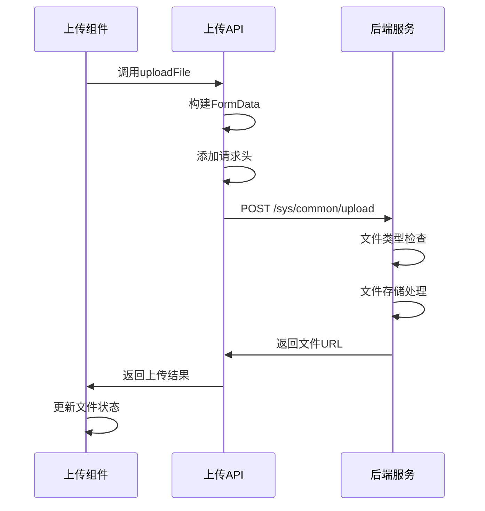

# JeecgBoot前端文件上传功能详解

## 概述

JeecgBoot前端提供了完整的文件上传解决方案，支持图片上传、文件上传、批量上传等多种场景。前端通过多个组件和API配合，实现了灵活、安全、易用的文件上传功能。

## 核心组件架构

### 1. 基础上传组件 (BasicUpload)

**文件路径**: `src/components/Upload/src/BasicUpload.vue`

**功能特点**:
- 提供统一的上传入口
- 支持文件预览和管理
- 集成上传模态框和预览模态框
- 支持批量文件操作

**核心代码结构**:
```vue
<template>
  <div>
    <a-button-group>
      <!-- 上传按钮 -->
      <a-button type="primary" @click="openUploadModal">
        {{ t('component.upload.upload') }}
      </a-button>
      <!-- 预览按钮 -->
      <a-button @click="openPreviewModal" v-if="showPreview">
        <Icon icon="bi:eye" />
      </a-button>
    </a-button-group>
    
    <!-- 上传模态框 -->
    <UploadModal @register="registerUploadModal" @change="handleChange" />
    <!-- 预览模态框 -->
    <UploadPreviewModal @register="registerPreviewModal" />
  </div>
</template>
```

### 2. 上传模态框 (UploadModal)

**文件路径**: `src/components/Upload/src/UploadModal.vue`

**核心功能**:
- 文件选择和预处理
- 文件类型和大小校验
- 批量上传处理
- 上传进度显示
- 错误处理和重试机制

**关键方法**:

```typescript
// 上传前校验
function beforeUpload(file: File) {
  const { size, name } = file;
  const { maxSize } = props;
  
  // 文件大小校验
  if (maxSize && file.size / 1024 / 1024 >= maxSize) {
    createMessage.error(t('component.upload.maxSizeMultiple', [maxSize]));
    return false;
  }
  
  // 文件类型校验
  if (accept.length > 0 && !checkFileType(file, accept)) {
    createMessage.error(t('component.upload.acceptUpload', [accept.join(',')]));
    return false;
  }
  
  return false; // 阻止默认上传，使用自定义上传
}

// 单个文件上传API调用
async function uploadApiByItem(item: FileItem) {
  const { api } = props;
  try {
    item.status = UploadResultStatus.UPLOADING;
    const { data } = await props.api?.({
      data: { ...(props.uploadParams || {}) },
      file: item.file,
      name: props.name,
      filename: props.filename,
    }, function onUploadProgress(progressEvent: ProgressEvent) {
      const complete = ((progressEvent.loaded / progressEvent.total) * 100) | 0;
      item.percent = complete;
    });
    
    item.status = UploadResultStatus.SUCCESS;
    item.responseData = data;
    return { success: true, error: null };
  } catch (e) {
    item.status = UploadResultStatus.ERROR;
    return { success: false, error: e };
  }
}
```

### 3. JUpload组件 (表单专用)

**文件路径**: `src/components/Form/src/jeecg/components/JUpload/JUpload.vue`

**特色功能**:
- 集成到JeecgBoot表单系统
- 支持业务路径配置 (bizPath)
- 支持图片和文件两种模式
- 支持返回URL或完整文件信息
- 内置文件预览功能

**核心属性**:
```typescript
const props = defineProps({
  value: propTypes.oneOfType([propTypes.string, propTypes.array]),
  text: propTypes.string.def('上传'),
  fileType: propTypes.string.def(UploadTypeEnum.all),
  bizPath: propTypes.string.def('temp'), // 业务路径
  returnUrl: propTypes.bool.def(true),   // 是否仅返回URL
  maxCount: propTypes.number.def(0),     // 最大上传数量
  multiple: propTypes.bool.def(true),    // 是否支持多选
  disabled: propTypes.bool.def(false),   // 是否禁用
});
```

**上传配置**:
```typescript
const bindProps = computed(() => {
  const bind: any = Object.assign({}, props, unref(attrs));
  bind.name = 'file';
  bind.listType = isImageMode.value ? 'picture-card' : 'text';
  bind.data = { biz: props.bizPath, ...bind.data }; // 业务路径参数
  
  // 图片模式自动设置accept
  if (isImageMode.value && !bind.accept) {
    bind.accept = 'image/*';
  }
  return bind;
});
```

## API接口层

### 1. 上传API配置

**文件路径**: `src/api/common/api.ts`

```typescript
// 上传接口地址配置
export const uploadUrl = `${baseUploadUrl}/sys/common/upload`;

// 文件上传方法
export const uploadFile = (params, success) => {
  return defHttp.uploadFile({ url: uploadUrl }, params, { success });
};
```

### 2. 环境配置

**开发环境配置** (`.env.development`):
```bash
# 后台接口全路径地址
VITE_GLOB_DOMAIN_URL=http://localhost:8080/jeecg-boot

# 后台接口父地址
VITE_GLOB_API_URL=/jeecgboot

# 代理配置
VITE_PROXY = [["jeecgboot","http://localhost:8080/jeecg-boot"],["upload","http://localhost:3300/upload"]]
```

### 3. 全局设置

**文件路径**: `src/hooks/setting/index.ts`

```typescript
export const useGlobSetting = (): Readonly<GlobConfig> => {
  const glob: Readonly<GlobConfig> = {
    title: VITE_GLOB_APP_TITLE,
    domainUrl: VITE_GLOB_DOMAIN_URL,
    apiUrl: VITE_GLOB_API_URL,
    uploadUrl: VITE_GLOB_DOMAIN_URL, // 上传服务地址
    // ... 其他配置
  };
  return glob;
};
```

## 工具函数

### 1. 文件访问路径处理

**文件路径**: `src/utils/common/compUtils.ts`

```typescript
/**
 * 获取文件服务访问路径
 * @param fileUrl 文件路径
 * @param prefix 文件路径前缀 (默认http)
 */
export const getFileAccessHttpUrl = (fileUrl, prefix = 'http') => {
  let result = fileUrl;
  try {
    if (fileUrl && fileUrl.length > 0 && !fileUrl.startsWith(prefix)) {
      let isArray = fileUrl.indexOf('[') != -1;
      if (!isArray) {
        let prefix = `${baseApiUrl}/sys/common/static/`;
        if (!fileUrl.startsWith(prefix)) {
          result = `${prefix}${fileUrl}`;
        }
      }
    }
  } catch (err) {}
  return result;
};

/**
 * 获取请求头信息
 */
export function getHeaders() {
  const token = getToken();
  const tenantId = getTenantId();
  return {
    'X-Access-Token': token,
    'tenant-id': tenantId,
  };
}
```

### 2. 文件类型检查

**文件路径**: `src/components/Upload/src/helper.ts`

```typescript
/**
 * 检查文件类型
 */
export function checkFileType(file: File, accepts: string[]) {
  const newTypes = accepts.join('|');
  const reg = new RegExp(`\\.(${newTypes})$`, 'i');
  return reg.test(file.name);
}

/**
 * 检查是否为图片类型
 */
export function checkImgType(file: File) {
  return /\.(jpg|jpeg|png|gif|bmp|webp)$/i.test(file.name);
}
```

## 使用示例

### 1. 基础文件上传

```vue
<template>
  <BasicUpload
    :maxSize="20"
    :maxNumber="5"
    :accept="['jpg', 'png', 'pdf']"
    :api="uploadApi"
    @change="handleUploadChange"
  />
</template>

<script setup>
import { BasicUpload } from '/@/components/Upload';
import { uploadFile } from '/@/api/common/api';

const uploadApi = uploadFile;

function handleUploadChange(fileList) {
  console.log('上传的文件列表:', fileList);
}
</script>
```

### 2. 表单中的文件上传

```vue
<template>
  <JUpload
    v-model:value="formData.attachments"
    :text="'选择文件'"
    :bizPath="'project/docs'"
    :maxCount="3"
    :returnUrl="true"
  />
</template>

<script setup>
import JUpload from '/@/components/Form/src/jeecg/components/JUpload/JUpload.vue';

const formData = reactive({
  attachments: '',
});
</script>
```

### 3. 图片上传组件

```vue
<template>
  <JUpload
    v-model:value="imageList"
    :fileType="'image'"
    :bizPath="'user/avatar'"
    :maxCount="1"
    :text="'上传头像'"
  />
</template>

<script setup>
const imageList = ref('');
</script>
```

## 上传流程详解

### 1. 文件选择阶段



### 2. 文件上传阶段



### 3. 数据处理阶段

```typescript
// JUpload组件的数据处理逻辑
function onFileChange(info) {
  if (info.file.status === 'done') {
    if (props.returnUrl) {
      // 仅返回文件URL
      handlePathChange();
    } else {
      // 返回完整文件信息
      let newFileList = [];
      for (const item of fileListTemp) {
        if (item.status === 'done') {
          let fileJson = {
            fileName: item.name,
            filePath: item.response.message,
            fileSize: item.size,
          };
          newFileList.push(fileJson);
        }
      }
      emitValue(JSON.stringify(newFileList));
    }
  }
}
```

## 配置参数详解

### 1. BasicUpload组件参数

| 参数 | 类型 | 默认值 | 说明 |
|------|------|--------|------|
| maxSize | number | - | 文件最大大小(MB) |
| maxNumber | number | - | 最大上传数量 |
| accept | string[] | - | 允许的文件类型 |
| api | Function | - | 上传API函数 |
| uploadParams | object | - | 上传额外参数 |
| multiple | boolean | true | 是否支持多选 |
| emptyHidePreview | boolean | false | 空文件时隐藏预览 |

### 2. JUpload组件参数

| 参数 | 类型 | 默认值 | 说明 |
|------|------|--------|------|
| value | string/array | - | 绑定值 |
| text | string | '上传' | 按钮文本 |
| fileType | string | 'all' | 文件类型(all/image) |
| bizPath | string | 'temp' | 业务路径 |
| returnUrl | boolean | true | 是否仅返回URL |
| maxCount | number | 0 | 最大上传数量 |
| multiple | boolean | true | 是否支持多选 |
| disabled | boolean | false | 是否禁用 |
| removeConfirm | boolean | false | 删除确认 |

## 安全特性

### 1. 文件类型校验
- 前端基于文件扩展名校验
- 后端基于文件内容校验
- 支持自定义文件类型白名单

### 2. 文件大小限制
- 前端预校验，提升用户体验
- 后端强制校验，确保安全性

### 3. 请求认证
- 自动添加Token认证头
- 支持多租户ID传递
- 防止未授权上传

### 4. 业务路径隔离
- 通过bizPath参数实现业务隔离
- 防止文件路径遍历攻击
- 支持动态路径配置

## 扩展功能

### 1. 自定义上传处理

```typescript
// 自定义beforeUpload处理
const customBeforeUpload = (file: File) => {
  // 自定义校验逻辑
  if (file.name.includes('sensitive')) {
    message.error('文件名包含敏感词');
    return false;
  }
  return true;
};
```

### 2. 上传进度监控

```typescript
// 监控上传进度
const onProgress = (progressEvent: ProgressEvent) => {
  const percent = Math.round(
    (progressEvent.loaded * 100) / progressEvent.total
  );
  console.log(`上传进度: ${percent}%`);
};
```

### 3. 错误处理机制

```typescript
// 统一错误处理
const handleUploadError = (error: any) => {
  if (error.response?.status === 413) {
    message.error('文件过大，请选择较小的文件');
  } else if (error.response?.status === 415) {
    message.error('不支持的文件类型');
  } else {
    message.error('上传失败，请重试');
  }
};
```

## 性能优化

### 1. 文件预处理
- 图片自动生成缩略图
- 大文件分片上传支持
- 重复文件检测

### 2. 网络优化
- 支持并发上传控制
- 自动重试机制
- 上传队列管理

### 3. 用户体验
- 实时上传进度显示
- 拖拽上传支持
- 文件预览功能

## 常见问题

### 1. 上传失败处理

**问题**: 文件上传失败，显示网络错误

**解决方案**:
1. 检查后端服务是否正常运行
2. 确认文件大小是否超出限制
3. 验证文件类型是否被允许
4. 检查网络连接状态

### 2. 文件路径问题

**问题**: 上传成功但无法访问文件

**解决方案**:
1. 检查文件存储路径配置
2. 确认静态资源访问权限
3. 验证文件URL拼接逻辑

### 3. 权限问题

**问题**: 提示无权限上传文件

**解决方案**:
1. 检查用户登录状态
2. 确认Token是否有效
3. 验证用户上传权限配置

## 总结

JeecgBoot前端文件上传功能通过多层次的组件设计，提供了完整、安全、易用的文件上传解决方案。从基础的文件选择到最终的文件存储，每个环节都有相应的校验和处理机制，确保了系统的稳定性和安全性。

开发者可以根据具体业务需求，选择合适的上传组件和配置参数，快速实现文件上传功能。同时，系统提供的扩展接口和自定义选项，也为特殊需求提供了灵活的解决方案。