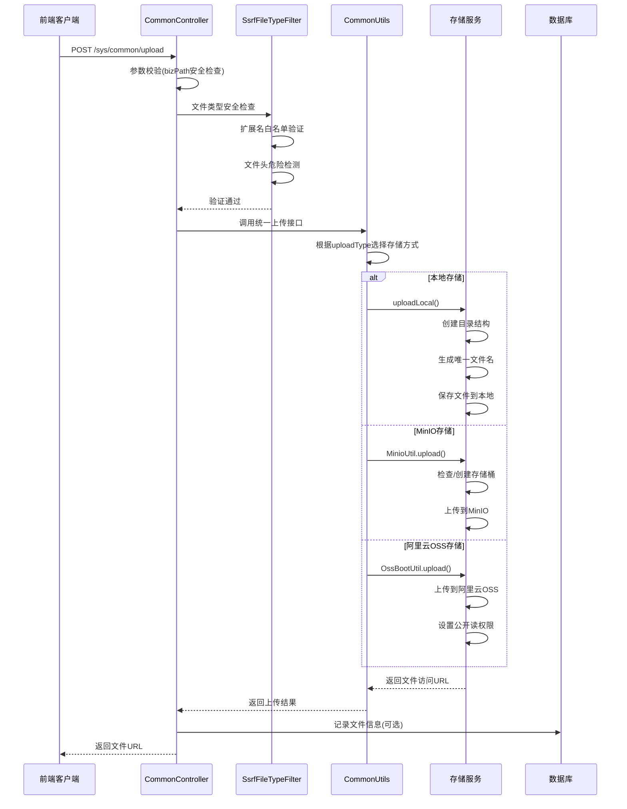

# JeecgBoot 文件上传功能架构分析

## 概述

本文档详细分析了JeecgBoot后端项目的文件上传功能架构，包括控制器层、服务层、存储工具类、安全过滤机制以及多种存储方式的实现。该文件上传系统设计合理，安全性高，扩展性强，支持本地存储、MinIO对象存储和阿里云OSS存储的灵活切换。

## 1. 核心控制器层实现

### 1.1 主要控制器

**文件位置：** `org.jeecg.modules.system.controller.CommonController`

### 1.2 核心功能

#### 统一上传接口
- **接口路径：** `/sys/common/upload`
- **功能描述：** 系统核心文件上传入口，支持多种存储方式
- **请求方式：** POST
- **参数说明：**
  - `file`: MultipartFile类型的上传文件
  - `bizPath`: 业务路径，用于文件分类存储

#### 参数安全校验
```java
// bizPath安全校验，防止路径遍历攻击
if (oConvertUtils.isNotEmpty(bizPath) && (bizPath.contains("../") || bizPath.contains("..\\")))
{
    throw new JeecgBootException("上传目录bizPath，格式非法！");
}
```

#### 存储方式选择逻辑
```java
// 根据配置自动选择存储方式
if (CommonConstant.UPLOAD_TYPE_OSS.equals(uploadType)) {
    url = OssBootUtil.upload(file, bizPath);
} else if (CommonConstant.UPLOAD_TYPE_MINIO.equals(uploadType)) {
    url = MinioUtil.upload(file, bizPath);
} else {
    url = uploadLocal(file, bizPath);
}
```

#### 文件下载接口
- **接口路径：** `/static/**`
- **功能描述：** 提供文件预览和下载功能
- **安全特性：** 集成SsrfFileTypeFilter进行文件类型检查

## 2. 服务层业务逻辑

### 2.1 主要服务类

**文件位置：** `org.jeecg.modules.content.service.impl.MediaFileServiceImpl`

### 2.2 文件上传核心流程

```java
@Override
public MediaFileEntity uploadFile(MultipartFile file, String storageType) {
    // 1. 文件非空检查
    if (file == null || file.isEmpty()) {
        throw new IllegalArgumentException("上传文件不能为空");
    }
    
    // 2. 计算文件MD5
    String md5 = calculateMD5(file);
    
    // 3. 检查文件是否已存在
    MediaFileEntity existingFile = getByMd5(md5);
    if (existingFile != null) {
        return existingFile;
    }
    
    // 4. 创建媒体文件实体
    MediaFileEntity mediaFile = createMediaFileEntity(file, md5, storageType);
    
    // 5. 上传文件到存储
    String fileUrl = uploadToStorage(file, storageType);
    mediaFile.setFileUrl(fileUrl);
    
    // 6. 保存到数据库
    save(mediaFile);
    
    // 7. 异步处理媒体文件（如生成缩略图）
    processMediaFileAsync(mediaFile);
    
    return mediaFile;
}
```

### 2.3 批量上传支持

```java
@Override
public List<MediaFileEntity> batchUploadFiles(List<MultipartFile> files, String storageType) {
    return files.stream()
            .map(file -> uploadFile(file, storageType))
            .collect(Collectors.toList());
}
```

## 3. 存储工具类和安全机制

### 3.1 安全过滤器

**文件位置：** `org.jeecg.common.util.filter.SsrfFileTypeFilter`

#### 文件类型白名单
```java
// 支持的安全文件类型
private static final String[] ALLOW_UPLOAD_FILE_SUFFIX = {
    "jpg", "jpeg", "gif", "png", "bmp", "ico", "svg",  // 图片类型
    "mp4", "avi", "rmvb", "mkv", "mov", "flv", "mp3", "wav", // 音视频类型
    "txt", "doc", "docx", "xls", "xlsx", "ppt", "pptx", "pdf", // 文档类型
    "zip", "rar", "7z", "tar", "gz" // 压缩文件类型
};
```

#### 危险文件检测
```java
// 禁止的文件头标记
private static final String[] DANGER_FILE_HEAD = {
    "jsp", "jspx", "php", "asp", "aspx", "js", "exe", "msi", "class", "jar"
};
```

#### 双重验证机制
1. **扩展名检查：** 验证文件扩展名是否在白名单中
2. **文件头检查：** 读取文件前10字节，验证真实文件类型

```java
public static void checkUploadFileType(MultipartFile file) {
    // 检查文件扩展名
    if (!checkAllowUpload(file.getOriginalFilename())) {
        throw new JeecgBootException("不支持的文件类型");
    }
    
    // 检查文件头
    if (checkDangerFileHead(file)) {
        throw new JeecgBootException("检测到危险文件类型");
    }
}
```

## 4. 多存储方式实现

### 4.1 统一上传接口

**文件位置：** `org.jeecg.common.util.CommonUtils`

```java
/**
 * 统一全局上传接口
 * @param file 上传文件
 * @param bizPath 业务路径
 * @param uploadType 上传类型
 * @return 文件访问URL
 */
public static String upload(MultipartFile file, String bizPath, String uploadType) {
    String url = "";
    try {
        if (CommonConstant.UPLOAD_TYPE_MINIO.equals(uploadType)) {
            url = MinioUtil.upload(file, bizPath);
        } else if (CommonConstant.UPLOAD_TYPE_OSS.equals(uploadType)) {
            url = OssBootUtil.upload(file, bizPath);
        } else {
            // 默认本地存储
            url = uploadLocal(file, bizPath, uploadPath);
        }
    } catch (Exception e) {
        log.error(e.getMessage(), e);
        throw new JeecgBootException(e.getMessage());
    }
    return url;
}
```

### 4.2 本地存储实现

#### 核心特性
- **存储路径：** 基于`${jeecg.path.upload}`配置的本地目录
- **文件命名：** 原文件名 + 时间戳，避免重名冲突
- **目录管理：** 自动创建业务路径目录结构
- **安全检查：** 集成SsrfFileTypeFilter进行文件类型验证

#### 实现代码
```java
public static String uploadLocal(MultipartFile mf, String bizPath, String uploadpath) {
    try {
        // 文件类型安全检查
        SsrfFileTypeFilter.checkUploadFileType(mf);
        
        // 创建存储目录
        File file = new File(uploadpath + File.separator + bizPath + File.separator);
        if (!file.exists()) {
            file.mkdirs();
        }
        
        // 生成唯一文件名
        String orgName = CommonUtils.getFileName(mf.getOriginalFilename());
        String fileName;
        if (orgName.indexOf(SymbolConstant.SPOT) != -1) {
            fileName = orgName.substring(0, orgName.lastIndexOf(".")) + "_" + 
                      System.currentTimeMillis() + orgName.substring(orgName.lastIndexOf("."));
        } else {
            fileName = orgName + "_" + System.currentTimeMillis();
        }
        
        // 保存文件
        String savePath = file.getPath() + File.separator + fileName;
        File savefile = new File(savePath);
        FileCopyUtils.copy(mf.getBytes(), savefile);
        
        // 返回数据库存储路径
        String dbpath = oConvertUtils.isNotEmpty(bizPath) ? 
                       bizPath + File.separator + fileName : fileName;
        return dbpath.replace("\\", "/");
    } catch (Exception e) {
        log.error(e.getMessage(), e);
        return "";
    }
}
```

### 4.3 阿里云OSS存储实现

**文件位置：** `org.jeecg.common.util.oss.OssBootUtil`

#### 核心特性
- **多种上传方式：** 支持MultipartFile、FileItemStream、InputStream
- **权限管理：** 自动设置存储桶公开读权限
- **自定义域名：** 支持配置静态域名访问
- **文件管理：** 提供文件删除、获取外链等功能

#### 上传实现
```java
public static String upload(MultipartFile file, String fileDir, String customBucket) throws Exception {
    // 文件类型安全检查
    SsrfFileTypeFilter.checkUploadFileType(file);
    
    // 初始化OSS客户端
    initOss(endPoint, accessKeyId, accessKeySecret);
    
    // 生成文件路径
    String suffix = file.getOriginalFilename().substring(file.getOriginalFilename().lastIndexOf('.'));
    String fileName = UUID.randomUUID().toString().replace("-", "") + suffix;
    String fileUrl = StrAttackFilter.filter(fileDir) + fileName;
    
    // 构建访问URL
    String filePath;
    if (oConvertUtils.isNotEmpty(staticDomain) && staticDomain.toLowerCase().startsWith(CommonConstant.STR_HTTP)) {
        filePath = staticDomain + SymbolConstant.SINGLE_SLASH + fileUrl;
    } else {
        filePath = "https://" + bucketName + "." + endPoint + SymbolConstant.SINGLE_SLASH + fileUrl;
    }
    
    // 上传文件
    PutObjectResult result = ossClient.putObject(bucketName, fileUrl, file.getInputStream());
    
    // 设置公开读权限
    ossClient.setBucketAcl(bucketName, CannedAccessControlList.PublicRead);
    
    if (result != null) {
        log.info("------OSS文件上传成功------" + fileUrl);
    }
    
    return filePath;
}
```

#### 文件删除功能
```java
public static void deleteUrl(String url, String bucket) {
    String newBucket = oConvertUtils.isNotEmpty(bucket) ? bucket : bucketName;
    String bucketUrl = oConvertUtils.isNotEmpty(staticDomain) && staticDomain.toLowerCase().startsWith(CommonConstant.STR_HTTP) ?
                      staticDomain + SymbolConstant.SINGLE_SLASH :
                      "https://" + newBucket + "." + endPoint + SymbolConstant.SINGLE_SLASH;
    
    url = url.replace(bucketUrl, "");
    ossClient.deleteObject(newBucket, url);
}
```

### 4.4 MinIO存储实现

**文件位置：** `org.jeecg.common.util.MinioUtil`

#### 核心特性
- **存储桶管理：** 自动创建和管理存储桶
- **文件流处理：** 支持InputStream直接上传
- **路径过滤：** 对bizPath进行特殊字符过滤
- **安全检查：** 集成文件类型安全验证

#### 上传实现
```java
public static String upload(MultipartFile file, String bizPath, String customBucket) throws Exception {
    // 文件类型安全检查
    SsrfFileTypeFilter.checkUploadFileType(file);
    
    // 初始化MinIO客户端
    initMinio(minioUrl, minioName, minioPass);
    
    String newBucketName = oConvertUtils.isNotEmpty(customBucket) ? customBucket : bucketName;
    
    // 检查并创建存储桶
    if (!minioClient.bucketExists(BucketExistsArgs.builder().bucket(newBucketName).build())) {
        minioClient.makeBucket(MakeBucketArgs.builder().bucket(newBucketName).build());
        log.info("创建新的存储桶: " + newBucketName);
    }
    
    // 处理文件路径
    bizPath = StrAttackFilter.filter(bizPath);
    String fileName = UUID.randomUUID().toString().replace("-", "") + 
                     file.getOriginalFilename().substring(file.getOriginalFilename().lastIndexOf('.'));
    String objectName = bizPath + "/" + fileName;
    
    // 上传文件
    PutObjectArgs objectArgs = PutObjectArgs.builder()
            .object(objectName)
            .bucket(newBucketName)
            .contentType(file.getContentType())
            .stream(file.getInputStream(), file.getSize(), -1)
            .build();
    
    minioClient.putObject(objectArgs);
    
    return minioUrl + "/" + newBucketName + "/" + objectName;
}
```

## 5. 配置管理

### 5.1 核心配置项

```yaml
jeecg:
  # 存储方式配置：local(本地)/minio(MinIO)/alioss(阿里云OSS)
  uploadType: local
  
  # 本地存储配置
  path:
    upload: /opt/upFiles  # 本地文件存储根目录
    webapp: /opt/webapp   # Web应用文件目录
  
  # 阿里云OSS配置
  oss:
    endpoint: oss-cn-beijing.aliyuncs.com  # OSS服务端点
    accessKey: ??                          # 访问密钥ID
    secretKey: ??                          # 访问密钥Secret
    bucketName: jeecgdev                   # 存储桶名称
    staticDomain: ??                       # 自定义静态域名
  
  # MinIO配置
  minio:
    minio_url: http://minio.jeecg.com      # MinIO服务地址
    minio_name: ??                         # MinIO用户名
    minio_pass: ??                         # MinIO密码
    bucketName: otatest                    # 存储桶名称
```

### 5.2 环境配置

不同环境可以配置不同的存储方式：
- **开发环境 (application-dev.yml)：** `uploadType: local`
- **测试环境 (application-test.yml)：** `uploadType: local`
- **生产环境 (application-prod.yml)：** `uploadType: alioss`

## 6. 整体架构流程

### 6.1 文件上传完整流程



### 6.2 关键处理步骤

1. **请求接收：** Controller层接收文件上传请求，验证必要参数
2. **安全校验：** 
   - bizPath路径遍历攻击防护
   - SsrfFileTypeFilter文件类型安全检查
3. **存储选择：** 根据`jeecg.uploadType`配置自动选择存储方式
4. **文件处理：**
   - 生成唯一文件名避免冲突
   - 创建必要的目录结构
   - 执行实际文件存储操作
5. **结果返回：** 返回文件访问URL给前端
6. **数据记录：** 可选择将文件信息保存到数据库
7. **异步处理：** 支持后台异步任务（如缩略图生成）

## 7. 安全特性总结

### 7.1 多层安全防护

1. **文件类型限制**
   - 基于白名单的文件扩展名检查
   - 文件头字节验证，防止文件类型伪装
   - 禁止上传可执行文件和脚本文件

2. **路径安全防护**
   - bizPath参数严格校验，防止目录遍历攻击
   - 特殊字符过滤，防止路径注入
   - 自动路径标准化处理

3. **文件大小控制**
   - 支持配置文件大小上限
   - 防止大文件攻击导致系统资源耗尽

4. **权限控制**
   - 集成系统权限体系
   - 支持接口级别的权限控制

### 7.2 安全配置建议

1. **生产环境配置**
   - 使用云存储服务（OSS/MinIO）而非本地存储
   - 配置合理的文件大小限制
   - 定期清理临时文件和无效文件

2. **网络安全**
   - 配置HTTPS访问
   - 设置合理的CORS策略
   - 使用CDN加速文件访问

## 8. 扩展性设计

### 8.1 存储方式扩展

系统采用策略模式设计，新增存储方式只需：
1. 实现对应的工具类（如XxxUtil）
2. 在CommonUtils.upload()方法中添加分支逻辑
3. 添加相应的配置项

### 8.2 文件处理扩展

支持扩展文件处理功能：
- 图片压缩和缩略图生成
- 文档格式转换
- 音视频转码
- 文件病毒扫描

### 8.3 业务集成扩展

- 支持不同业务模块的文件上传需求
- 可配置不同业务的存储策略
- 支持文件生命周期管理

## 9. 性能优化建议

### 9.1 上传性能优化

1. **分片上传：** 对于大文件支持分片上传
2. **并发上传：** 支持多文件并发上传
3. **断点续传：** 网络中断后支持续传
4. **压缩上传：** 对图片等文件进行压缩后上传

### 9.2 存储性能优化

1. **CDN加速：** 使用CDN加速文件访问
2. **缓存策略：** 合理设置文件缓存策略
3. **负载均衡：** 多存储节点负载均衡
4. **异步处理：** 文件处理任务异步化

## 10. 监控和运维

### 10.1 监控指标

- 文件上传成功率
- 文件上传耗时
- 存储空间使用情况
- 文件访问频率
- 异常文件上传统计

### 10.2 日志记录

```java
// 上传成功日志
log.info("文件上传成功 - 文件名: {}, 大小: {}, 存储方式: {}, 耗时: {}ms", 
         fileName, fileSize, uploadType, duration);

// 上传失败日志
log.error("文件上传失败 - 文件名: {}, 错误信息: {}", fileName, e.getMessage(), e);

// 安全检查日志
log.warn("检测到不安全文件上传尝试 - 文件名: {}, IP: {}", fileName, clientIp);
```

## 11. 总结

JeecgBoot的文件上传功能架构具有以下优势：

1. **架构清晰：** 分层明确，职责单一，易于维护和扩展
2. **安全可靠：** 多层安全防护，有效防范各种文件上传攻击
3. **灵活配置：** 支持多种存储方式，可根据需求灵活切换
4. **统一接口：** 提供统一的上传接口，屏蔽底层存储差异
5. **扩展性强：** 采用策略模式，易于扩展新的存储方式
6. **性能优化：** 支持异步处理，提升系统响应性能

该文件上传系统是一个成熟的企业级解决方案，可以满足大多数业务场景的文件管理需求。在实际使用中，建议根据具体的业务需求和部署环境，选择合适的存储方式和安全策略。