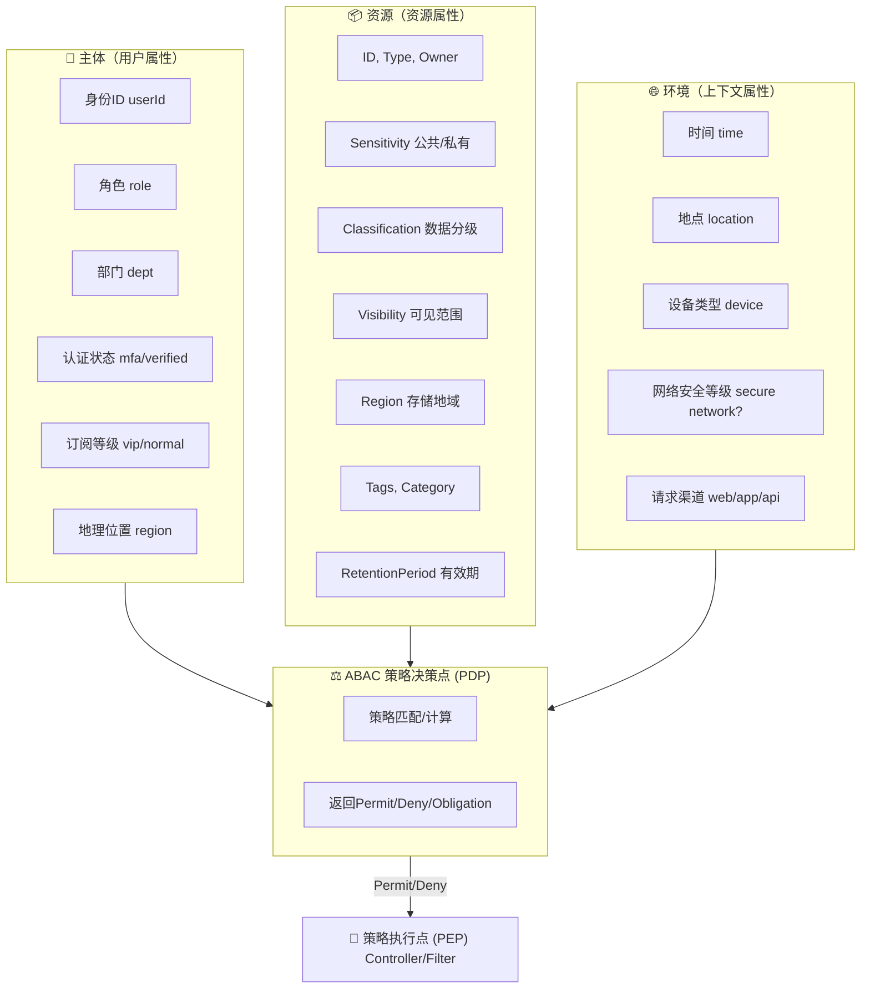

# ABAC 权限管理系统设计文档

## 1. 概述

### 1.1 什么是 ABAC

ABAC（Attribute-Based Access Control，基于属性的访问控制）是一种灵活的权限控制模型，通过评估主体（Subject）、资源（Resource）、环境（Environment）的属性来做出访问决策。

### 1.2 ABAC 核心组件

在做 ABAC 资源建模时，我们需要考虑三类属性：

1. **通用元数据**（所有资源必备）
2. **安全相关属性**（访问控制关键）
3. **业务领域属性**（特定业务策略需要）

## 2. 资源属性建模

### 2.1 通用元数据

几乎所有资源都需要的基础属性：

- **id**：资源唯一标识
- **type**：资源类型（文档、频道、订单、用户数据）
- **owner**：创建者/归属人
- **createTime**：创建时间
- **updateTime**：最后修改时间
- **status**：资源状态（active, archived, deleted 等）

### 2.2 安全与合规属性

主要服务于安全策略和审计合规：

- **sensitivity**：数据敏感度（public / protected / private / confidential / secret）
- **classification**：数据分级（如金融/医疗可用 Level 1–5）
- **retentionPeriod**：保存周期，是否过期可访问
- **ownerDept**：归属部门（用于部门级访问）
- **region**：资源存放地域（如 EU/US/SG，涉及数据合规 GDPR 等）
- **encryption**：是否加密、加密级别
- **auditLevel**：访问是否必须记录审计日志

### 2.3 访问与共享属性

支持复杂的访问场景：

- **visibility**：可见范围（public, group, private, tenant）
- **sharedWith**：共享用户或群组列表
- **accessPolicy**：绑定的访问策略 ID（用于自定义规则）
- **tags**：标签（可能影响分类、策略匹配）
- **validPeriod**：有效期（资源访问窗口）

### 2.4 内容与上下文属性

与资源内容本身相关：

- **category**：内容类别（新闻、合同、医疗记录…）
- **keywords**：关键字/标签
- **contentType**：文本/视频/音频/文件
- **size**：大小（可能限制下载/访问）

### 2.5 审计与合规辅助属性

为合规和审计提供更多上下文：

- **lastAccessTime**：最后访问时间
- **lastAccessUser**：最后访问人
- **accessCount**：访问次数
- **legalHold**：是否处于法律保留状态（不可删除/修改）
- **complianceMark**：合规标识（HIPAA, GDPR, SOX…）

### 2.6 可选业务领域属性

比如内容管理系统（CMS）或金融系统：

- **channelId**（频道资源归属）
- **projectId**（项目资源归属）
- **transactionType**（交易类型：支付/退款）
- **riskLevel**（交易或内容的风险级别）

### 2.7 设计建议

- **属性分层**：
  - 基础属性（所有资源必有）
  - 安全属性（安全、合规相关）
  - 业务属性（可选，业务决定）

- **可扩展性**：
  - 使用 JSON/Schema 形式存储，保证灵活（如 MongoDB 或 JSONB）

- **策略引用**：
  - 不必所有属性都用于决策，但要保证"可被引用"
  - 建议通过属性字典统一定义（避免策略写死字段名）

### 2.8 资源属性示例

文章资源（content）可能具备以下属性：

```json
{
  "id": "c-1001",
  "type": "content",
  "owner": "u-2001",
  "createTime": "2025-10-01T08:00:00Z",
  "updateTime": "2025-10-02T12:00:00Z",
  "sensitivity": "protected",
  "classification": "internal",
  "visibility": "group",
  "channelId": "ch-3001",
  "tags": ["vip", "tutorial"],
  "validPeriod": "2025-12-31T23:59:59Z"
}
```

## 3. ABAC 资源属性建模参考表

按照 **分层 → 属性名称 → 示例值 → 设计说明** 来组织，便于在实际项目中直接套用或裁剪。

| 层级 | 属性名称 | 示例值 | 设计说明 |
|------|----------|--------|----------|
| **基础元数据** | id | doc-1001 | 资源唯一标识（UUID/自增ID） |
| | type | document / content / channel | 资源类型，用于策略匹配 |
| | owner | user-2001 | 资源归属人（创建者/责任人） |
| | createTime | 2025-10-01T08:00:00Z | 创建时间，用于时效策略 |
| | updateTime | 2025-10-02T12:00:00Z | 修改时间，用于变更审计 |
| | status | active / archived / deleted | 资源状态，用于访问过滤 |
| **安全与合规属性** | sensitivity | public / protected / private | 数据敏感度分级 |
| | classification | L1（普通）/ L3（机密） | 组织内部数据分级（如金融/政府体系） |
| | retentionPeriod | 2026-01-01 | 保留到期时间，过期后禁止访问 |
| | ownerDept | finance / hr | 所属部门，支持部门级访问控制 |
| | region | EU / US / SG | 存储地域，涉及数据主权合规（GDPR 等） |
| | encryption | AES256 / PLAINTEXT | 加密方式，控制敏感资源访问 |
| | auditLevel | standard / strict | 审计力度，决定是否强制记录访问日志 |
| **访问与共享属性** | visibility | public / group / private / tenant | 可见范围 |
| | sharedWith | [user-3001, user-3002] | 指定共享对象，资源 ACL 列表 |
| | accessPolicy | policy-123 | 绑定的自定义访问策略 ID |
| | tags | ["vip","tutorial"] | 标签，用于动态策略匹配 |
| | validPeriod | 2025-12-31T23:59:59Z | 有效期控制 |
| **内容与上下文属性** | category | contract / article | 内容类别 |
| | keywords | ["AI","finance"] | 关键字，可作为策略条件 |
| | contentType | text / video / audio | 媒体类型 |
| | size | 12MB | 资源大小，可能影响下载权限 |
| **审计与合规辅助属性** | lastAccessTime | 2025-10-02T10:00:00Z | 最近访问时间 |
| | lastAccessUser | user-4001 | 最近访问人 |
| | accessCount | 157 | 累计访问次数 |
| | legalHold | true | 是否法律保留（不可删除/修改） |
| | complianceMark | GDPR / HIPAA | 合规标记，受特定法规保护 |
| **可选业务领域属性** | channelId | ch-3001 | 所属频道（CMS 场景） |
| | projectId | pj-9001 | 所属项目（项目管理系统） |
| | transactionType | payment / refund | 交易类型（金融场景） |
| | riskLevel | low / medium / high | 风险等级（风控场景） |

### 3.1 使用建议

- **最小集设计**：实际建模时不要一股脑塞入所有属性，只挑选业务需要的
- **属性字典化**：统一定义枚举值（如 sensitivity，classification），避免策略写死字符串
- **扩展性**：资源属性推荐存为 JSON，ABAC 引擎可动态解析（避免表字段爆炸）
- **组合策略**：
  - RBAC/PBAC 控制"是否有资格访问"
  - ABAC 基于这些资源属性控制"能否在当前上下文访问"

## 4. ABAC 属性交互关系

### 4.1 架构图



### 4.2 组件解读

1. **Subject（用户属性）**
   - 用户的基本信息：ID、角色、部门
   - 动态状态：是否通过多因子认证，是否 VIP，所在位置等

2. **Resource（资源属性）**
   - 基础属性：ID、类型、归属人
   - 安全属性：敏感度、分级、可见性、地域
   - 生命周期：有效期、保留期、审计要求

3. **Environment（环境属性）**
   - 请求上下文：时间、地点、设备、网络环境
   - 安全因素：是否来自受信任渠道（如 VPN 内网 / API Gateway）

4. **策略决策 PDP**
   - 收集 Subject + Resource + Environment 属性
   - 执行 SAPL / XACML 等 ABAC 策略
   - 产出三类结果：
     - **Permit**（允许）
     - **Deny**（拒绝）
     - **Permit with Obligation**（允许但附加约束，如强制审计、脱敏显示）

5. **策略执行 PEP**
   - 通常在 Controller / Service 层拦截
   - 根据 PDP 的结果决定是否继续执行请求

## 5. ABAC 策略示例

### 5.1 策略示例表

涵盖「VIP 内容访问」和「频道管理」等常见场景：

| 策略场景 | 主体属性 (Subject) | 资源属性 (Resource) | 环境属性 (Environment) | 策略判定 (Policy) | 结果 (Effect) |
|----------|-------------------|-------------------|----------------------|------------------|---------------|
| VIP 内容访问 | 用户 role=admin | type=content AND sensitivity=vip | 任意 | admin 可以访问所有 VIP 内容 | Permit |
| VIP 内容访问 | 用户 subscription=vip | type=content AND sensitivity=vip | 当前日期在 validPeriod 内 | 付费 VIP 用户在有效期内可访问 VIP 内容 | Permit |
| VIP 内容访问 | 用户 subscription=trial | type=content AND sensitivity=vip | 当前时间 ≤ trialExpireTime | 试用用户在试用期内可访问 VIP 内容 | Permit |
| VIP 内容访问 | 用户 subscription=none | type=content AND sensitivity=vip | 任意 | 普通用户不能访问 VIP 内容 | Deny |
| 频道管理 | 用户 role=systemAdmin | type=channel | 任意 | 系统管理员可编辑任意频道 | Permit |
| 频道管理 | 用户 role=channelAdmin AND userId = channel.owner | type=channel AND id=channelId | 任意 | 频道管理员只能编辑自己负责的频道 | Permit |
| 频道管理 | 用户 role=channelAdmin AND userId ≠ channel.owner | type=channel AND id ≠ channelId | 任意 | 频道管理员不能编辑其他频道 | Deny |
| 用户文章编辑 | 用户 role=editor | type=document | 任意 | 编辑用户有权限编辑所有文章 | Permit |
| 用户文章编辑 | 用户 role=user AND userId=document.owner | type=document | 任意 | 普通用户只能编辑自己的文章 | Permit |
| 用户文章编辑 | 用户 role=user AND userId ≠ document.owner | type=document | 任意 | 普通用户不能编辑他人文章 | Deny |

### 5.2 策略解读

- **主体属性（谁在访问？）**：包含用户角色、ID、订阅状态等
- **资源属性（访问什么？）**：包含资源类型、敏感度、归属人、频道 ID 等
- **环境属性（在什么情况下？）**：包含时间、地点、设备、安全环境
- **策略判定**：表达具体的 ABAC 规则，通常使用 SAPL 或 XACML 表达式实现
- **结果**：最终的决策：Permit（允许）、Deny（拒绝）、Permit with Obligation（允许但附带义务，如脱敏显示或审计）

## 6. 双向屏蔽关系设计

### 6.1 需求场景

双向屏蔽关系，即：
- **A 不想看 B** → A 在获取资源时要屏蔽掉 B 发布的内容
- **A 不想让 B 看 A** → B 在获取资源时要屏蔽掉 A 发布的内容

这是社交产品里很常见的需求（类似微博、Facebook、知乎的屏蔽功能）。

### 6.2 ABAC 设计思路

#### 6.2.1 新增资源属性

在资源（Resource）模型中增加 visibilityRules 或 blockedBy 字段：
- **ownerId** → 内容的创建者 ID（比如 A）
- **blockedBy** → 记录主动屏蔽该内容的用户 ID 列表（如 A 把 B 屏蔽，则 A 的资源上 blockedBy=[B]）

#### 6.2.2 新增主体属性

主体（Subject，即用户）增加：
- **blockList** → 当前用户屏蔽了哪些人（如 A 屏蔽了 B → blockList=[B]）

#### 6.2.3 策略规则

在 PDP（策略决策点）中增加判定逻辑：
- 访问别人内容时：
  - 如果 `resource.owner ∈ subject.blockList` → 拒绝（A 不看 B）
  - 如果 `subject.userId ∈ resource.blockedBy` → 拒绝（B 不能看 A）

#### 6.2.4 策略判定表

| 场景 | Subject（访问者） | Resource（内容） | 判定逻辑 | 结果 |
|------|------------------|-----------------|----------|------|
| A 浏览 B 的内容 | A.blockList 包含 B | resource.owner=B | A 不看 B → Deny | Deny |
| B 浏览 A 的内容 | B ∈ resource.blockedBy | resource.owner=A | A 屏蔽 B，不让 B 看 → Deny | Deny |
| A 浏览 C 的内容 | C 不在 A.blockList | resource.owner=C | 没有互斥 → Permit | Permit |
| C 浏览 A 的内容 | C 不在 A.blockedBy | resource.owner=A | 没有互斥 → Permit | Permit |

### 6.3 架构设计建议

#### 6.3.1 屏蔽关系存储

在数据库中建立一张 `user_block` 表：

| user_id | blocked_user_id | create_time |
|---------|-----------------|-------------|
| A       | B               | 2025-10-02  |

在资源查询时做 join 或缓存映射。

#### 6.3.2 缓存优化

- 用户登录时，把 blockList 拉到缓存（Redis/本地缓存）
- 资源读取时，在 ABAC PDP 内快速判断（set 查找）

#### 6.3.3 审计/解释

若用户访问被拒绝，PDP 返回 Deny + Reason：
- "You blocked this user"
- "This user blocked you"

#### 6.3.4 合规性

在日志中只记录 "拒绝原因类别"，避免泄露用户关系链。
比如只记 "denied by privacy policy"，而不是 "B blocked A"。

### 6.4 ABAC 策略（SAPL 伪码）

```sapl
policy "deny when subject blocks resource owner" 
    deny
    target subject.blockList.contains(resource.owner)

policy "deny when resource owner blocks subject" 
    deny
    target resource.blockedBy.contains(subject.userId)

policy "default permit"
    permit
```

这样，A 不看 B 和 B 不能看 A 可以通过对称 ABAC 策略来同时满足。关键就是建模时让用户关系属性（blockList/blockedBy）成为 ABAC 的资源与主体属性。

## 7. 总结

本文档详细介绍了 ABAC 权限管理系统的设计方案，包括：

1. **资源属性建模**：从通用元数据到业务领域属性的完整分层设计
2. **属性交互关系**：Subject、Resource、Environment 三者的协同工作机制
3. **策略示例**：涵盖常见业务场景的具体策略配置
4. **双向屏蔽关系**：社交场景下的复杂权限控制实现

通过合理的属性建模和策略设计，ABAC 能够提供灵活、细粒度的权限控制，满足复杂业务场景的需求。

