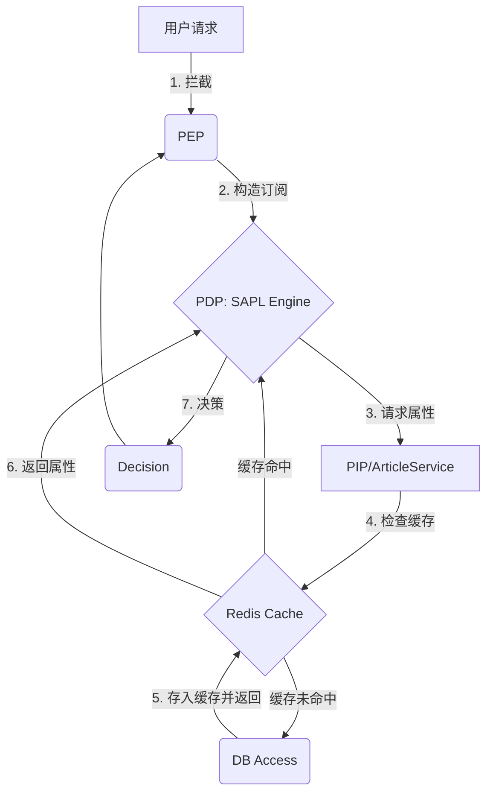

好的，这是一份关于 **SAPL (Streaming Attribute Policy Language)** 结合 **Spring Boot 3** 实现企业级 **ABAC (Attribute-Based Access Control)** 的技术文档，侧重流程、原理和实战案例。

-----

# SAPL + Spring Boot 3 企业级 ABAC 权限控制指南

## 1\. SAPL 核心原理与架构流程

SAPL 是一种基于属性流的访问控制（ASBAC）引擎，它将权限策略（Policy）从代码中分离出来，实现授权的外部化。它完美地融入了 Spring Security 生态。

### 1.1 核心组件与流程（P-P-P-P 模型）

SAPL 的授权流程基于四个核心组件，共同构成了权限决策的完整生命周期：

| 组件 | 全称 (英文) | 职责 | 位于 Spring Boot 应用何处 |
| :--- | :--- | :--- | :--- |
| **PEP** | Policy Enforcement Point | **策略执行点**：负责拦截请求，构造授权订阅 (Subscription)，并根据 PDP 的决策结果执行或拒绝操作。 | Spring Security Filter Chain, `@PreEnforce` / `@PostEnforce` 注解。 |
| **PDP** | Policy Decision Point | **策略决策点**：SAPL 引擎的核心。接收 PEP 的订阅，评估所有适用的策略，并返回最终的决策 (Decision)。 | 嵌入式 (`sapl-spring-pdp-embedded`) 或远程服务。 |
| **PRP** | Policy Retrieval Point | **策略检索点**：负责存储和检索 `.sapl` 策略文件。 | 通常是应用资源文件夹 (`src/main/resources/policies`) 或数据库。 |
| **PIP** | Policy Information Point | **策略信息点**：负责收集**动态属性**（如用户角色、文章作者、实时时间、部门信息等），为 PDP 提供决策所需的所有上下文数据。 | 带有 `@PolicyInformationPoint` 注解的 Spring Bean 或数据库查询。 |

### 1.2 授权请求流程图

SAPL 的授权流程是一个请求-响应或订阅-流动的过程：

```mermaid
graph TD
    A[用户发起请求: edit /article/123] -->|1. 拦截请求| B(PEP: Policy Enforcement Point);
    B -->|2. 构造授权订阅 (Subscription)| C{PDP: Policy Decision Point};
    C -->|3. 请求策略和属性| D[PRP: 检索策略];
    C -->|3. 请求策略和属性| E[PIP: 收集动态属性 (如作者ID)];
    D -->|4. 返回策略| C;
    E -->|4. 返回属性| C;
    C -->|5. 评估所有策略| F(AuthorizationDecision: Permit/Deny);
    F -->|6. 返回决策| B;
    B -->|7. 执行/拒绝操作| G[业务逻辑或 HTTP 403];
```

## 2\. 核心技术实现：依赖与注解

### 2.1 基础依赖配置

在 `pom.xml` 中添加核心 SAPL 依赖（使用嵌入式 PDP）：

```xml
<dependencies>
    <dependency>
        <groupId>org.springframework.boot</groupId>
        <artifactId>spring-boot-starter-web</artifactId>
    </dependency>
    <dependency>
        <groupId>org.springframework.boot</groupId>
        <artifactId>spring-boot-starter-security</artifactId>
    </dependency>
    
    <dependency>
        <groupId>io.sapl</groupId>
        <artifactId>sapl-spring-security</artifactId>
        <version>${sapl.version}</version>
    </dependency>
    <dependency>
        <groupId>io.sapl</groupId>
        <artifactId>sapl-spring-pdp-embedded</artifactId>
        <version>${sapl.version}</version>
    </dependency>
</dependencies>
```

### 2.2 PEP 的声明式实现：`@PreEnforce`

SAPL 的 PEP 实现非常简单，通过 `@PreEnforce` 或 `@PostEnforce` 注解完成权限检查。

| SAPL 授权元素 | 对应 `PreEnforce` 属性 | SpEL 表达式源 |
| :--- | :--- | :--- |
| **Subject** | `subject` | `authentication` 对象，从中获取用户 ID/角色/部门等。 |
| **Action** | `action` | 通常是硬编码字符串（如 `'edit'`）或方法名。 |
| **Resource** | `resource` | 方法参数 (`#paramName`)，或通过 `@Service.method()` 查询获取动态数据。 |
| **Environment**| `environment`| 运行时上下文，如当前时间、IP 地址等。 |

## 3\. 案例一：Owner 资源处理（作者编辑自己的文章）

### 3.1 策略 (PRP)

目标：**管理员** 可以编辑所有文章；**作者** 只能编辑自己的文章。

文件：`src/main/resources/policies/article.sapl`

```sapl
set "article_editing_rules"
// 优先采用 'first-applicable'，管理员策略优先
combiningAlgorithm "first-applicable" 

// 策略 1: 允许管理员操作
policy "permit_admin_edit_all"
permit
    subject.role == "ADMIN"
where
    action == "edit";

// 策略 2: 允许作者操作自己的资源
policy "permit_author_edit_own"
permit
    subject.role == "AUTHOR"
where
    action == "edit"
    // 核心判断：Subject ID 必须等于 Resource 属性中的 authorId
    & subject.id == resource.authorId; 
```

### 3.2 实现 (PEP/PIP)

需要一个 **PIP 辅助方法** 来动态查询文章的作者 ID。

```java
// PIP 辅助：通过文章ID查询作者ID
@Service
public class ArticleService {
    // 假设这是通过数据库查询获取文章作者ID的方法
    public Long getAuthorIdByArticleId(Long articleId) {
        // ... 数据库查询逻辑，返回文章的 authorId
        return 42L; // 示例数据
    }
}

// PEP: Controller 层
@PutMapping("/articles/{id}")
@PreEnforce(
    // Subject: 从认证主体中获取当前用户的ID和角色
    subject = "authentication.principal.id, authentication.principal.role", 
    action = "'edit'", 
    // Resource: 调用 Spring Bean 方法获取文章作者 ID 作为资源属性
    resource = "{ 'authorId': @articleService.getAuthorIdByArticleId(#id) }"
)
public Article updateArticle(@PathVariable Long id, @RequestBody Article article) {
    // 只有决策为 PERMIT 时才会执行
    return articleService.update(id, article);
}
```

-----

## 4\. 案例二：频道管理与范围限制

### 4.1 策略 (PRP)

目标：**频道管理员/版主** 只能对**本频道内**成员禁言；**系统管理员** 可以对**所有**频道成员禁言。

文件：`src/main/resources/policies/channel.sapl`

```sapl
set "channel_mute_rules"
combiningAlgorithm "deny-unless-permit" 

// 策略 1: 允许系统管理员操作
policy "permit_system_admin_mute_any"
permit
    subject.role == "SYSTEM_ADMIN"
where
    action == "mute";

// 策略 2: 允许频道工作人员操作本频道
policy "permit_staff_mute_own_channel"
permit
    (subject.role == "CHANNEL_MANAGER" | subject.role == "MODERATOR")
where
    action == "mute"
    // 核心判断：主体的频道 ID 必须等于资源的频道 ID
    & subject.channelId == resource.channelId;
```

### 4.2 实现 (PEP)

需要确保用户的认证主体（Subject）包含 `channelId` 属性。

```java
// PEP: Controller 层
@PostMapping("/channels/{channelId}/mute")
@PreEnforce(
    // Subject: 假设认证主体（如 JWT Token）已包含 role 和 channelId
    subject = "authentication.principal.role, authentication.principal.channelId", 
    action = "'mute'", 
    // Resource: 目标频道 ID
    resource = "{ 'channelId': #channelId }" 
)
public void muteChannelMember(@PathVariable String channelId, @RequestParam String memberId) {
    // ... 业务逻辑
}
```

-----

## 5\. 案例三：基于环境的访问控制（时间限制）

### 5.1 策略 (PRP)

目标：**公司员工** 只有在 **工作时间**（例如 9:00 - 17:00）才能访问**自己部门**的数据。

文件：`src/main/resources/policies/department-data.sapl`

```sapl
set "department_access_rules"
combiningAlgorithm "deny-unless-permit"

// 策略：限制部门数据访问
policy "permit_department_access_during_work_hours"
permit
    // 假设所有普通员工角色为 EMPLOYEE
    subject.role == "EMPLOYEE"
where
    action == "read"
    // 1. 部门限制：用户部门与数据部门一致
    & subject.department == resource.department
    // 2. 时间限制：使用 SAPL 内置或自定义的时间函数
    & time.is_within_interval("09:00:00", "17:00:00"); 
```

### 5.2 实现 (PEP)

在这种情况下，SAPL 提供了内置的 **PIP** 来处理时间相关的属性，你无需额外编写代码。

```java
// PEP: Controller 层
@GetMapping("/data/department/{deptId}")
@PreEnforce(
    // Subject: 获取用户角色和部门
    subject = "authentication.principal.role, authentication.principal.department", 
    action = "'read'", 
    // Resource: 目标部门 ID
    resource = "{ 'department': #deptId }", 
    // Environment: SAPL 默认会注入 time.now 等环境属性
    environment = "{}" 
)
public List<DataItem> getDepartmentData(@PathVariable String deptId) {
    // ... 业务逻辑
}
```

## 6\. 性能优化：结合 Redis 缓存

在企业级应用中，频繁的权限检查（尤其是 PIP 涉及数据库查询时）会产生性能瓶颈。利用 **Spring Cache** 和 **Redis** 进行缓存是最佳实践。

### 6.1 PIP 属性数据缓存（推荐方式）

性能问题最常见于 **PIP** 调用数据库查询动态属性时。我们应在 PIP 方法上直接使用 Spring Cache。

```java
import org.springframework.cache.annotation.Cacheable;

// 假设这是文章服务的 PIP 辅助方法
@Service
public class ArticleService {
    
    // 使用 @Cacheable，文章作者ID会被缓存，
    // 避免每次编辑请求都去查数据库
    @Cacheable(cacheNames = "article-author-cache", key = "#articleId")
    public Long getAuthorIdByArticleId(Long articleId) {
        // 只有缓存过期或未命中时才会执行数据库查询
        System.out.println("-> DB Query: Fetching author for article " + articleId);
        // ... DB access
        return 42L; 
    }
    // ...
}
```

### 6.2 流程图：加入缓存机制



通过以上步骤，你的 Spring Boot 3 应用就拥有了一套功能强大、灵活且高性能的企业级 ABAC 权限控制系统。开发者可以通过修改 `.sapl` 策略文件来调整权限规则，而无需修改任何 Java 业务代码。