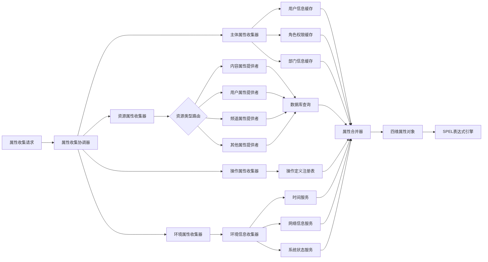
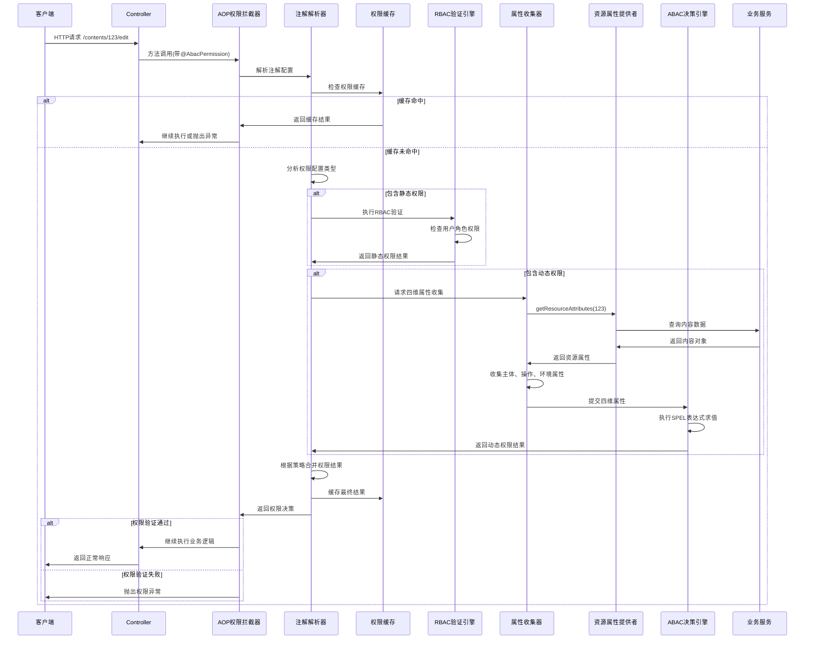
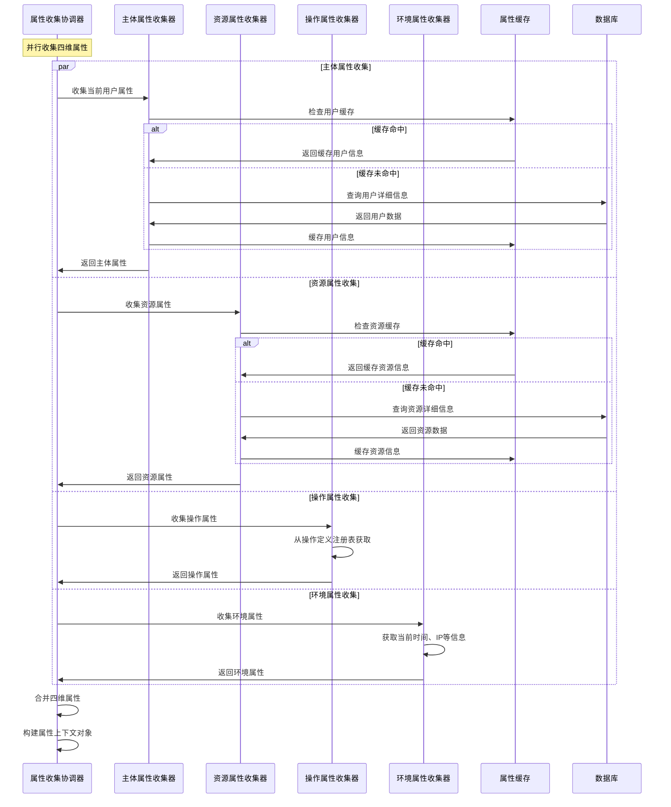
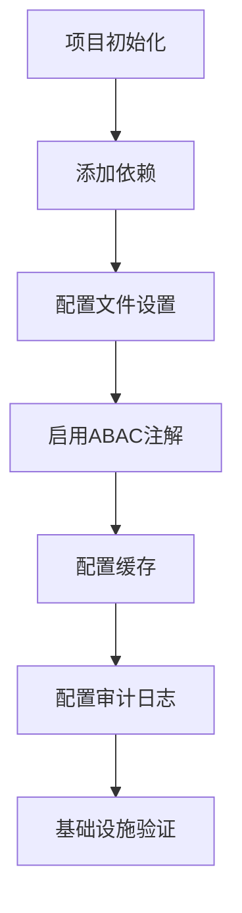

# ABAC+RBAC 混合权限控制系统技术文档

## 1. 系统概述

基于属性的访问控制（ABAC）与基于角色的访问控制（RBAC）混合权限系统，通过统一的`@AbacPermission`注解同时支持静态权限验证和动态属性评估。系统通过四维属性模型（主体、资源、操作、环境）实现细粒度权限控制，同时保留传统RBAC的简洁性和高效性。采用注解驱动、接口化注册的设计理念，为开发者提供一站式权限管理解决方案。

### 1.1 核心特性
- **双模式权限控制**: 同时支持RBAC静态权限和ABAC动态权限
- **统一注解接口**: 单个`@AbacPermission`注解满足所有权限控制需求
- **灵活决策策略**: 支持AND/OR逻辑组合静态权限与动态表达式
- **高性能设计**: 静态权限优先验证，动态权限按需计算
- **零侵入集成**: 注解驱动，业务代码无感知权限逻辑

## 2. 核心设计原理

### 2.1 混合权限控制模型

系统采用RBAC+ABAC混合模型，结合静态权限的高效性和动态权限的灵活性：

#### 2.1.1 静态权限层（RBAC）
- **角色权限映射**: 用户通过角色获得预定义权限
- **权限字符串匹配**: 基于权限标识符进行快速验证
- **高性能验证**: 内存缓存，毫秒级响应
- **适用场景**: 标准业务操作、系统管理功能

#### 2.1.2 动态权限层（ABAC）
- **四维属性模型**: 主体、资源、操作、环境四维度动态评估
- **表达式引擎**: 基于SPEL的灵活策略表达式
- **实时计算**: 根据当前上下文动态决策
- **适用场景**: 复杂业务规则、个性化权限控制

### 2.2 四维属性模型详解

#### 2.2.1 主体属性(Subject)
```
信用等级: gold, silver, bronze
风险评分: 0-100
用户基础信息: id, username, roles, departments
业务属性: age, level, experience, certification
动态属性: currentRole, activeChannels, managedResources
```

#### 2.2.2 资源属性(Resource)
```
基础属性: id, type, owner, createTime, updateTime
业务属性: status, category, level, visibility
Sensitivity 公共/私有
Classification 数据分级
Visibility 可见范围
关联属性: channelId, parentId, tags, metadata
数据敏感度: public, protected, private
```

#### 2.2.3 操作属性(Action)
```
操作类型: view, create, edit, delete, approve, publish
风险级别: low, medium, high, critical
业务分类: content, user, system, financial
```

#### 2.2.4 环境属性(Environment)
```
时间维度: currentTime, businessHour, workday, season
网络环境: ipAddress, location, device, browser
系统状态: systemLoad, maintenanceMode, emergencyMode
```

### 2.3 混合决策流程

权限决策采用分层验证策略，优先验证高效的静态权限，按需计算动态权限：

```
访问允许 ⟺ 静态权限验证 ⊕ 动态权限验证
其中 ⊕ 表示可配置的逻辑组合（AND/OR）
```

#### 2.3.1 决策优先级
1. **静态权限优先**: 如果配置了静态权限，优先验证
2. **动态权限补充**: 静态权限不足时，启用动态权限计算
3. **组合策略**: 支持AND/OR逻辑组合两种权限结果

## 3. 系统架构图

### 3.1 整体架构图

```mermaid
graph TB
    A[客户端请求] --> B{@AbacPermission注解}
    B -->|有注解| C[AOP权限拦截器]
    B -->|无注解| D[正常业务流程]
    
    C --> E[注解解析器]
    E --> F{权限配置分析}
    
    F -->|仅静态权限| G[RBAC权限验证器]
    F -->|仅动态权限| H[ABAC属性收集器]
    F -->|混合权限| I[混合权限决策器]
    
    G --> J[权限缓存]
    J --> K{静态权限验证}
    K -->|通过| M[允许访问]
    K -->|拒绝| N[权限异常]
    
    H --> O[四维属性收集]
    O --> P[主体属性提供者]
    O --> Q[资源属性提供者]
    O --> R[操作属性提供者]
    O --> S[环境属性提供者]
    
    P --> T[SPEL策略引擎]
    Q --> T
    R --> T
    S --> T
    
    T --> U{动态表达式求值}
    U -->|true| M
    U -->|false| N
    
    I --> V[静态权限预检]
    V --> W{预检结果}
    W -->|通过且策略为OR| M
    W -->|失败且策略为AND| N
    W -->|需要动态验证| H
    
    M --> D
    N --> X[抛出权限异常]
    
    subgraph "属性提供者注册中心"
        Y[内容属性提供者]
        Z[用户属性提供者]
        AA[频道属性提供者]
        BB[评论属性提供者]
    end
    
    Q --> Y
    Q --> Z
    Q --> AA
    Q --> BB
```

### 3.2 权限决策流程图

```mermaid
flowchart TD
    A[接收权限验证请求] --> B[解析@AbacPermission注解]
    B --> C{是否配置静态权限?}
    
    C -->|是| D[执行RBAC权限验证]
    C -->|否| E[跳过静态权限验证]
    
    D --> F{静态权限验证结果}
    F -->|通过| G{权限合并策略}
    F -->|失败| H{权限合并策略}
    
    G -->|OR策略| I[允许访问]
    G -->|AND策略| J{是否配置动态权限?}
    
    H -->|AND策略| K[拒绝访问]
    H -->|OR策略| L{是否配置动态权限?}
    
    E --> M{是否配置动态权限?}
    J -->|是| N[收集四维属性]
    L -->|是| N
    M -->|是| N
    M -->|否| O[无权限配置，默认拒绝]
    
    J -->|否| I
    L -->|否| K
    
    N --> P[执行SPEL表达式求值]
    P --> Q{动态权限验证结果}
    
    Q -->|通过| R{来源于哪个分支?}
    Q -->|失败| S{来源于哪个分支?}
    
    R -->|静态权限通过+AND| I
    R -->|静态权限失败+OR| I
    R -->|仅动态权限| I
    
    S -->|静态权限通过+AND| K
    S -->|静态权限失败+OR| K
    S -->|仅动态权限| K
    
    I --> T[继续业务流程]
    K --> U[抛出权限异常]
    O --> U
```

### 3.3 属性收集架构图



## 4. 核心组件设计

### 4.1 统一权限注解 (`@AbacPermission`)

#### 4.1.1 注解定义
```java
@Target(ElementType.METHOD)
@Retention(RetentionPolicy.RUNTIME)
@Documented
public @interface AbacPermission {
    // === 资源定义 ===
    String resourceType();                    // 资源类型，如 "content", "user", "channel"
    String resourceId() default "";           // 资源ID的SPEL表达式，如 "#id", "#request.contentId"
    
    // === 操作定义 ===
    String action();                         // 操作类型，如 "view", "edit", "delete"
    
    // === 静态权限配置（RBAC） ===
    String[] staticPermissions() default {}; // 静态权限列表，如 {"content:edit", "admin:manage"}
    boolean ownerBypass() default false;     // 资源所有者是否自动拥有权限
    
    // === 动态权限配置（ABAC） ===
    String dynamicExpression() default "";   // 动态权限SPEL表达式
    
    // === 权限合并策略 ===
    PermissionStrategy strategy() default PermissionStrategy.OR;
    
    // === 性能优化配置 ===
    boolean enableCache() default true;      // 是否启用权限缓存
    int cacheTimeout() default 300;         // 缓存超时时间（秒）
    
    // === 异常处理配置 ===
    String errorMessage() default "";       // 自定义错误消息
    Class<? extends Exception> errorType() default PermissionDeniedException.class;
}

/**
 * 权限合并策略枚举
 */
public enum PermissionStrategy {
    AND,    // 静态权限 AND 动态权限（都必须通过）
    OR,     // 静态权限 OR 动态权限（任一通过即可）
    STATIC_FIRST,  // 优先静态权限，失败时尝试动态权限
    DYNAMIC_ONLY   // 仅使用动态权限
}
```

#### 4.1.2 使用示例

**纯静态权限（传统RBAC）**
```java
@GetMapping("/admin/users")
@AbacPermission(
    resourceType = "user",
    action = "list",
    staticPermissions = {"user:list", "admin:manage"}
)
public List<User> listUsers() {
    // 业务逻辑
}
```

**纯动态权限（纯ABAC）**
```java
@PostMapping("/contents/{id}/view")
@AbacPermission(
    resourceType = "content",
    resourceId = "#id",
    action = "view",
    strategy = PermissionStrategy.DYNAMIC_ONLY,
    dynamicExpression = "subject.age >= resource.minAgeRequired or subject.roles contains 'ADMIN'"
)
public Content viewContent(@PathVariable Long id) {
    // 业务逻辑
}
```

**混合权限（RBAC+ABAC）**
```java
@PutMapping("/contents/{id}/edit")
@AbacPermission(
    resourceType = "content",
    resourceId = "#id",
    action = "edit",
    staticPermissions = {"content:edit"},
    ownerBypass = true,
    strategy = PermissionStrategy.OR,
    dynamicExpression = "subject.department == resource.authorDepartment and environment.isBusinessHour"
)
public Content editContent(@PathVariable Long id, @RequestBody ContentUpdateRequest request) {
    // 业务逻辑
}
```

**复杂业务场景**
```java
@PostMapping("/channels/{channelId}/contents/publish")
@AbacPermission(
    resourceType = "content",
    resourceId = "#request.contentId",
    action = "publish",
    staticPermissions = {"content:publish"},
    strategy = PermissionStrategy.AND,
    dynamicExpression = """
        (subject.managedChannelIds contains #channelId) and
        (resource.status == 'DRAFT' or resource.status == 'REVIEWING') and
        (resource.createTime > environment.currentTime - days(30)) and
        (not resource.isAdultContent or subject.age >= 18)
    """,
    errorMessage = "您没有权限发布此内容，请检查频道管理权限和内容状态"
)
public void publishContent(@PathVariable Long channelId, @RequestBody PublishRequest request) {
    // 业务逻辑
}
```

### 4.2 属性提供者接口体系

#### 4.2.1 核心接口定义
```java
/**
 * 资源属性提供者接口
 * 负责提供特定资源类型的属性信息
 */
public interface ResourceAttributeProvider {
    /**
     * 获取支持的资源类型
     */
    String getSupportedResourceType();
    
    /**
     * 获取资源属性
     * @param resourceId 资源ID
     * @return 资源属性映射
     */
    Map<String, Object> getResourceAttributes(Object resourceId);
    
    /**
     * 批量获取资源属性（性能优化）
     */
    default Map<Object, Map<String, Object>> getBatchResourceAttributes(List<Object> resourceIds) {
        return resourceIds.stream()
            .collect(Collectors.toMap(id -> id, this::getResourceAttributes));
    }
    
    /**
     * 获取属性缓存键
     */
    default String getCacheKey(Object resourceId) {
        return getSupportedResourceType() + ":" + resourceId;
    }
    
    /**
     * 属性缓存时间（秒）
     */
    default int getCacheTimeout() {
        return 300; // 5分钟
    }
}

/**
 * 主体属性提供者接口
 */
public interface SubjectAttributeProvider {
    /**
     * 获取当前用户的主体属性
     */
    Map<String, Object> getSubjectAttributes();
    
    /**
     * 获取指定用户的主体属性
     */
    Map<String, Object> getSubjectAttributes(Long userId);
}

/**
 * 环境属性提供者接口
 */
public interface EnvironmentAttributeProvider {
    /**
     * 获取当前环境属性
     */
    Map<String, Object> getEnvironmentAttributes();
}
```

#### 4.2.2 实现示例

**内容属性提供者**
```java
@Component
@Slf4j
public class ContentAttributeProvider implements ResourceAttributeProvider {
    
    @Autowired
    private ContentService contentService;
    
    @Override
    public String getSupportedResourceType() {
        return "content";
    }
    
    @Override
    public Map<String, Object> getResourceAttributes(Object resourceId) {
        Long contentId = Long.valueOf(resourceId.toString());
        Content content = contentService.getById(contentId);
        
        if (content == null) {
            throw new ResourceNotFoundException("内容不存在: " + contentId);
        }
        
        return Map.of(
            "id", content.getId(),
            "ownerId", content.getAuthorId(),
            "authorId", content.getAuthorId(),
            "channelId", content.getChannelId(),
            "status", content.getStatus(),
            "minAgeRequired", content.getMinAgeRequired(),
            "isAdultContent", content.getIsAdultContent(),
            "createTime", content.getCreateTime(),
            "updateTime", content.getUpdateTime(),
            "category", content.getCategory(),
            "tags", content.getTags(),
            "visibility", content.getVisibility()
        );
    }
}
```

### 4.3 权限决策引擎

#### 4.3.1 混合权限决策器
```java
@Component
public class HybridPermissionDecisionEngine {
    
    /**
     * 执行混合权限决策
     */
    public PermissionDecisionResult decide(PermissionContext context) {
        AbacPermission annotation = context.getAnnotation();
        PermissionStrategy strategy = annotation.strategy();
        
        // 1. 静态权限验证
        boolean staticResult = false;
        if (hasStaticPermissions(annotation)) {
            staticResult = evaluateStaticPermissions(context);
        }
        
        // 2. 动态权限验证
        boolean dynamicResult = false;
        if (hasDynamicExpression(annotation)) {
            dynamicResult = evaluateDynamicExpression(context);
        }
        
        // 3. 根据策略合并结果
        boolean finalResult = mergeResults(staticResult, dynamicResult, strategy, annotation);
        
        return PermissionDecisionResult.builder()
            .allowed(finalResult)
            .staticResult(staticResult)
            .dynamicResult(dynamicResult)
            .strategy(strategy)
            .build();
    }
    
    private boolean mergeResults(boolean staticResult, boolean dynamicResult, 
                               PermissionStrategy strategy, AbacPermission annotation) {
        switch (strategy) {
            case AND:
                return staticResult && dynamicResult;
            case OR:
                return staticResult || dynamicResult;
            case STATIC_FIRST:
                return staticResult || (!hasStaticPermissions(annotation) && dynamicResult);
            case DYNAMIC_ONLY:
                return dynamicResult;
            default:
                return false;
        }
    }
}
```

### 4.4 性能优化组件

#### 4.4.1 权限缓存管理器
```java
@Component
public class PermissionCacheManager {
    
    @Autowired
    private RedisTemplate<String, Object> redisTemplate;
    
    /**
     * 获取权限缓存
     */
    public Optional<Boolean> getCachedPermission(String cacheKey) {
        Object cached = redisTemplate.opsForValue().get(cacheKey);
        return cached != null ? Optional.of((Boolean) cached) : Optional.empty();
    }
    
    /**
     * 缓存权限结果
     */
    public void cachePermission(String cacheKey, boolean result, int timeout) {
        redisTemplate.opsForValue().set(cacheKey, result, Duration.ofSeconds(timeout));
    }
    
    /**
     * 生成权限缓存键
     */
    public String generateCacheKey(PermissionContext context) {
        return String.format("perm:%s:%s:%s:%s", 
            context.getUserId(),
            context.getResourceType(),
            context.getResourceId(),
            context.getAction()
        );
    }
}
```

## 5. 完整工作流程

### 5.1 权限验证时序图



### 5.2 混合权限决策详细流程

```mermaid
flowchart TD
    A[接收权限验证请求] --> B[解析@AbacPermission注解]
    B --> C[生成权限缓存键]
    C --> D{检查权限缓存}
    
    D -->|缓存命中| E[返回缓存结果]
    D -->|缓存未命中| F[分析权限配置]
    
    F --> G{是否配置静态权限?}
    G -->|是| H[执行RBAC权限验证]
    G -->|否| I[跳过静态权限验证]
    
    H --> J[检查用户角色权限]
    J --> K{静态权限验证结果}
    K -->|通过| L{权限合并策略分析}
    K -->|失败| M{权限合并策略分析}
    
    I --> N{是否配置动态权限?}
    L -->|OR策略| O[权限验证通过]
    L -->|AND策略| P{是否配置动态权限?}
    L -->|STATIC_FIRST策略| O
    
    M -->|AND策略| Q[权限验证失败]
    M -->|OR策略| R{是否配置动态权限?}
    M -->|STATIC_FIRST策略| S{是否配置动态权限?}
    
    P -->|是| T[收集四维属性]
    P -->|否| O
    R -->|是| T
    R -->|否| Q
    S -->|是| T
    S -->|否| Q
    N -->|是| T
    N -->|否| U[无权限配置，默认拒绝]
    
    T --> V[收集主体属性]
    T --> W[收集资源属性]
    T --> X[收集操作属性]
    T --> Y[收集环境属性]
    
    V --> Z[执行SPEL表达式求值]
    W --> Z
    X --> Z
    Y --> Z
    
    Z --> AA{动态权限验证结果}
    AA -->|通过| BB{结合静态权限结果}
    AA -->|失败| CC{结合静态权限结果}
    
    BB -->|静态通过+AND| O
    BB -->|静态失败+OR| O
    BB -->|仅动态权限| O
    BB -->|DYNAMIC_ONLY| O
    
    CC -->|静态通过+AND| Q
    CC -->|静态失败+OR| Q
    CC -->|仅动态权限| Q
    CC -->|DYNAMIC_ONLY| Q
    
    O --> DD[缓存权限结果]
    Q --> EE[缓存权限结果]
    U --> EE
    
    DD --> FF[继续业务流程]
    EE --> GG[抛出权限异常]
    E --> HH{缓存结果}
    HH -->|允许| FF
    HH -->|拒绝| GG
```

### 5.3 属性收集协调流程



### 5.4 组件协作关系

#### 5.4.1 核心组件交互
1. **AOP拦截器**: 拦截带有`@AbacPermission`注解的方法调用
2. **注解解析器**: 解析注解参数，确定权限验证策略
3. **权限缓存管理器**: 提供高性能的权限结果缓存
4. **RBAC验证引擎**: 执行传统的角色权限验证
5. **属性收集协调器**: 并行收集四维属性数据
6. **ABAC决策引擎**: 基于属性执行动态权限表达式
7. **混合权限决策器**: 根据策略合并静态和动态权限结果

#### 5.4.2 性能优化策略
1. **缓存优先**: 权限结果和属性数据多级缓存
2. **并行收集**: 四维属性并行收集，减少总耗时
3. **懒加载**: 按需收集属性，避免不必要的数据库查询
4. **批量处理**: 支持批量资源属性获取
5. **短路求值**: 静态权限通过时可跳过动态权限计算（OR策略）

## 6. 扩展性设计

### 6.1 新增资源类型扩展

#### 6.1.1 扩展步骤
1. **实现资源属性提供者**
```java
@Component
public class CustomResourceAttributeProvider implements ResourceAttributeProvider {
    @Override
    public String getSupportedResourceType() {
        return "customResource";
    }
    
    @Override
    public Map<String, Object> getResourceAttributes(Object resourceId) {
        // 实现自定义资源属性获取逻辑
        return customAttributes;
    }
}
```

2. **在Controller中使用**
```java
@PostMapping("/custom/{id}/action")
@AbacPermission(
    resourceType = "customResource",
    resourceId = "#id",
    action = "customAction",
    dynamicExpression = "subject.customField == resource.customProperty"
)
public void performCustomAction(@PathVariable Long id) {
    // 业务逻辑
}
```

#### 6.1.2 自动注册机制
系统通过Spring的`@Component`注解自动发现和注册资源属性提供者，无需手动配置。

### 6.2 权限策略扩展

#### 6.2.1 自定义权限策略
```java
public enum CustomPermissionStrategy implements PermissionStrategy {
    WEIGHTED_DECISION {
        @Override
        public boolean evaluate(boolean staticResult, boolean dynamicResult, 
                              Map<String, Object> context) {
            // 基于权重的决策逻辑
            double staticWeight = (Double) context.get("staticWeight");
            double dynamicWeight = (Double) context.get("dynamicWeight");
            return (staticResult ? staticWeight : 0) + 
                   (dynamicResult ? dynamicWeight : 0) > 0.5;
        }
    },
    
    TIME_BASED_FALLBACK {
        @Override
        public boolean evaluate(boolean staticResult, boolean dynamicResult, 
                              Map<String, Object> context) {
            // 时间段内优先静态权限，其他时间使用动态权限
            LocalTime now = LocalTime.now();
            boolean isBusinessHour = now.isAfter(LocalTime.of(9, 0)) && 
                                   now.isBefore(LocalTime.of(18, 0));
            return isBusinessHour ? staticResult : dynamicResult;
        }
    }
}
```

#### 6.2.2 表达式函数扩展
```java
@Component
public class CustomSpelFunctions {
    
    /**
     * 检查用户是否在指定地理区域
     */
    public static boolean inRegion(String userLocation, String allowedRegion) {
        // 地理位置验证逻辑
        return GeographyUtils.isInRegion(userLocation, allowedRegion);
    }
    
    /**
     * 检查时间是否在工作日
     */
    public static boolean isWorkday(LocalDateTime dateTime) {
        DayOfWeek dayOfWeek = dateTime.getDayOfWeek();
        return dayOfWeek != DayOfWeek.SATURDAY && dayOfWeek != DayOfWeek.SUNDAY;
    }
    
    /**
     * 计算用户信用评分
     */
    public static double calculateCreditScore(Long userId) {
        // 信用评分计算逻辑
        return CreditService.calculateScore(userId);
    }
}
```

**在表达式中使用自定义函数**
```java
@AbacPermission(
    resourceType = "sensitiveData",
    action = "access",
    dynamicExpression = """
        @customSpelFunctions.inRegion(environment.userLocation, 'DOMESTIC') and
        @customSpelFunctions.isWorkday(environment.currentTime) and
        @customSpelFunctions.calculateCreditScore(subject.id) > 80.0
    """
)
```

### 6.3 属性收集器扩展

#### 6.3.1 自定义主体属性收集器
```java
@Component
public class EnhancedSubjectAttributeProvider implements SubjectAttributeProvider {
    
    @Override
    public Map<String, Object> getSubjectAttributes() {
        User currentUser = SecurityUtils.getCurrentUser();
        
        return Map.of(
            // 基础属性
            "id", currentUser.getId(),
            "username", currentUser.getUsername(),
            "roles", currentUser.getRoles(),
            
            // 扩展属性
            "department", currentUser.getDepartment(),
            "level", currentUser.getLevel(),
            "certification", currentUser.getCertifications(),
            "experience", calculateExperience(currentUser),
            
            // 动态属性
            "currentRole", getCurrentActiveRole(currentUser),
            "managedChannelIds", getManagedChannels(currentUser),
            "recentActivity", getRecentActivity(currentUser)
        );
    }
}
```

#### 6.3.2 自定义环境属性收集器
```java
@Component
public class EnhancedEnvironmentAttributeProvider implements EnvironmentAttributeProvider {
    
    @Override
    public Map<String, Object> getEnvironmentAttributes() {
        HttpServletRequest request = getCurrentRequest();
        
        return Map.of(
            // 时间属性
            "currentTime", LocalDateTime.now(),
            "isBusinessHour", isBusinessHour(),
            "isWorkday", isWorkday(),
            "season", getCurrentSeason(),
            
            // 网络属性
            "ipAddress", getClientIpAddress(request),
            "location", getLocationByIp(request),
            "device", getDeviceInfo(request),
            "browser", getBrowserInfo(request),
            
            // 系统属性
            "systemLoad", getSystemLoad(),
            "maintenanceMode", isMaintenanceMode(),
            "emergencyMode", isEmergencyMode()
        );
    }
}
```

### 6.4 缓存策略扩展

#### 6.4.1 多级缓存配置
```java
@Configuration
public class PermissionCacheConfiguration {
    
    @Bean
    public CacheManager permissionCacheManager() {
        return CacheManager.builder()
            // L1缓存：本地内存缓存
            .l1Cache(CaffeineCache.builder()
                .maximumSize(10000)
                .expireAfterWrite(Duration.ofMinutes(5))
                .build())
            // L2缓存：Redis分布式缓存
            .l2Cache(RedisCache.builder()
                .keyPrefix("permission:")
                .defaultExpiration(Duration.ofMinutes(15))
                .build())
            .build();
    }
}
```

#### 6.4.2 智能缓存失效
```java
@Component
public class SmartCacheInvalidator {
    
    @EventListener
    public void handleUserRoleChange(UserRoleChangeEvent event) {
        // 用户角色变更时，清除相关权限缓存
        String pattern = "permission:" + event.getUserId() + ":*";
        cacheManager.evictByPattern(pattern);
    }
    
    @EventListener
    public void handleResourceUpdate(ResourceUpdateEvent event) {
        // 资源更新时，清除相关权限缓存
        String pattern = "permission:*:" + event.getResourceType() + ":" + event.getResourceId() + ":*";
        cacheManager.evictByPattern(pattern);
    }
}
```

### 6.5 监控和审计扩展

#### 6.5.1 权限决策审计
```java
@Component
public class PermissionAuditLogger {
    
    @EventListener
    public void logPermissionDecision(PermissionDecisionEvent event) {
        PermissionAuditLog auditLog = PermissionAuditLog.builder()
            .userId(event.getUserId())
            .resourceType(event.getResourceType())
            .resourceId(event.getResourceId())
            .action(event.getAction())
            .decision(event.isAllowed())
            .staticResult(event.getStaticResult())
            .dynamicResult(event.getDynamicResult())
            .strategy(event.getStrategy())
            .executionTime(event.getExecutionTime())
            .timestamp(LocalDateTime.now())
            .build();
            
        auditLogService.save(auditLog);
    }
}
```

#### 6.5.2 性能监控
```java
@Component
public class PermissionPerformanceMonitor {
    
    private final MeterRegistry meterRegistry;
    
    @EventListener
    public void recordPermissionMetrics(PermissionDecisionEvent event) {
        // 记录权限验证耗时
        Timer.Sample sample = Timer.start(meterRegistry);
        sample.stop(Timer.builder("permission.decision.time")
            .tag("resource.type", event.getResourceType())
            .tag("action", event.getAction())
            .tag("strategy", event.getStrategy().name())
            .register(meterRegistry));
            
        // 记录权限验证结果分布
        Counter.builder("permission.decision.result")
            .tag("result", event.isAllowed() ? "allowed" : "denied")
            .tag("resource.type", event.getResourceType())
            .register(meterRegistry)
            .increment();
    }
}
```

## 7. 技术优势

1. **声明式编程**: 注解驱动，业务逻辑与权限控制分离
2. **动态决策**: 基于实时属性计算，无需预定义权限规则
3. **细粒度控制**: 支持实例级、属性级权限控制
4. **易于扩展**: 接口化设计，新资源类型无缝集成
5. **灵活策略**: 支持SPEL表达式，满足复杂业务场景

## 8. 实施指南

### 8.1 系统集成步骤

#### 8.1.1 依赖配置
```xml
<!-- Maven依赖配置 -->
<dependency>
    <groupId>org.jeecg</groupId>
    <artifactId>jeecg-boot-starter-abac</artifactId>
    <version>${jeecg.version}</version>
</dependency>

<dependency>
    <groupId>org.springframework.boot</groupId>
    <artifactId>spring-boot-starter-aop</artifactId>
</dependency>

<dependency>
    <groupId>org.springframework</groupId>
    <artifactId>spring-expression</artifactId>
</dependency>
```

#### 8.1.2 配置文件设置
```yaml
# application.yml
jeecg:
  abac:
    # 启用ABAC权限控制
    enabled: true
    
    # 缓存配置
    cache:
      enabled: true
      type: redis
      default-expiration: 300
      max-size: 10000
    
    # 性能配置
    performance:
      # 异步处理属性收集
      async-attribute-collection: true
      # 批量权限验证
      batch-validation: true
      # 预加载常用属性
      preload-attributes: true
    
    # 审计配置
    audit:
      enabled: true
      level: INFO
      include-success: false
      include-failure: true
    
    # 默认策略配置
    default:
      strategy: OR
      on-denied: THROW_EXCEPTION
      cacheable: true
      cache-expiration: 300

# Redis配置（如果使用Redis缓存）
spring:
  redis:
    host: localhost
    port: 6379
    database: 0
    timeout: 2000ms
    lettuce:
      pool:
        max-active: 8
        max-idle: 8
        min-idle: 0
```

#### 8.1.3 启动类配置
```java
@SpringBootApplication
@EnableAbacPermission  // 启用ABAC权限控制
@EnableCaching         // 启用缓存支持
public class Application {
    public static void main(String[] args) {
        SpringApplication.run(Application.class, args);
    }
}
```

### 8.2 开发实施流程

#### 8.2.1 第一阶段：基础设施搭建


**实施检查清单：**
- [ ] Maven/Gradle依赖已添加
- [ ] 配置文件已正确设置
- [ ] 启动类已添加@EnableAbacPermission注解
- [ ] Redis连接正常（如使用Redis缓存）
- [ ] 基础权限验证功能正常

#### 8.2.2 第二阶段：属性提供者实现
```java
/**
 * 实施步骤：
 * 1. 分析业务资源类型
 * 2. 实现对应的AttributeProvider
 * 3. 注册到Spring容器
 * 4. 测试属性收集功能
 */

// 示例：用户属性提供者
@Component
public class UserSubjectAttributeProvider implements SubjectAttributeProvider {
    
    @Autowired
    private UserService userService;
    
    @Override
    public Map<String, Object> getSubjectAttributes() {
        User currentUser = SecurityUtils.getCurrentUser();
        if (currentUser == null) {
            return Collections.emptyMap();
        }
        
        return Map.of(
            "id", currentUser.getId(),
            "username", currentUser.getUsername(),
            "roles", currentUser.getRoles().stream()
                .map(Role::getCode)
                .collect(Collectors.toList()),
            "department", currentUser.getDepartment(),
            "level", currentUser.getLevel(),
            "dataScope", currentUser.getDataScope()
        );
    }
}
```

#### 8.2.3 第三阶段：权限注解应用
```java
/**
 * 实施策略：
 * 1. 从简单场景开始
 * 2. 逐步增加复杂度
 * 3. 充分测试每个场景
 */

// 第一步：简单静态权限
@GetMapping("/users")
@AbacPermission(
    staticPermissions = {"user:list"}
)
public List<UserVO> listUsers() {
    return userService.listUsers();
}

// 第二步：简单动态权限
@GetMapping("/users/{id}")
@AbacPermission(
    resourceType = "user",
    resourceId = "#id",
    action = "view",
    dynamicExpression = "resource.id == subject.id or subject.roles.contains('ADMIN')"
)
public UserVO getUser(@PathVariable Long id) {
    return userService.getUserById(id);
}

// 第三步：混合权限控制
@PutMapping("/users/{id}")
@AbacPermission(
    resourceType = "user",
    resourceId = "#id",
    action = "edit",
    staticPermissions = {"user:edit"},
    dynamicExpression = """
        (resource.id == subject.id) or
        (subject.roles.contains('ADMIN')) or
        (subject.roles.contains('HR') and resource.department == subject.department)
    """,
    strategy = PermissionStrategy.AND
)
public void updateUser(@PathVariable Long id, @RequestBody UserUpdateVO user) {
    userService.updateUser(id, user);
}
```

### 8.3 测试策略

#### 8.3.1 单元测试
```java
@SpringBootTest
@TestPropertySource(properties = {
    "jeecg.abac.enabled=true",
    "jeecg.abac.cache.enabled=false"  // 测试时禁用缓存
})
class AbacPermissionTest {
    
    @Autowired
    private UserController userController;
    
    @MockBean
    private SecurityUtils securityUtils;
    
    @Test
    @WithMockUser(roles = "USER")
    void testUserCanViewOwnProfile() {
        // 模拟当前用户
        User mockUser = createMockUser(1L, "testuser", "USER");
        when(SecurityUtils.getCurrentUser()).thenReturn(mockUser);
        
        // 测试访问自己的资料
        assertDoesNotThrow(() -> {
            userController.getUser(1L);
        });
    }
    
    @Test
    @WithMockUser(roles = "USER")
    void testUserCannotViewOthersProfile() {
        // 模拟当前用户
        User mockUser = createMockUser(1L, "testuser", "USER");
        when(SecurityUtils.getCurrentUser()).thenReturn(mockUser);
        
        // 测试访问他人资料应该被拒绝
        assertThrows(AccessDeniedException.class, () -> {
            userController.getUser(2L);
        });
    }
    
    @Test
    @WithMockUser(roles = "ADMIN")
    void testAdminCanViewAnyProfile() {
        // 模拟管理员用户
        User mockAdmin = createMockUser(1L, "admin", "ADMIN");
        when(SecurityUtils.getCurrentUser()).thenReturn(mockAdmin);
        
        // 测试管理员可以访问任何用户资料
        assertDoesNotThrow(() -> {
            userController.getUser(2L);
        });
    }
}
```

#### 8.3.2 集成测试
```java
@SpringBootTest(webEnvironment = SpringBootTest.WebEnvironment.RANDOM_PORT)
@AutoConfigureTestDatabase(replace = AutoConfigureTestDatabase.Replace.NONE)
class AbacPermissionIntegrationTest {
    
    @Autowired
    private TestRestTemplate restTemplate;
    
    @Autowired
    private UserRepository userRepository;
    
    @Test
    void testCompletePermissionFlow() {
        // 1. 创建测试用户
        User testUser = createAndSaveUser("testuser", "USER");
        User adminUser = createAndSaveUser("admin", "ADMIN");
        
        // 2. 测试用户登录并获取Token
        String userToken = loginAndGetToken("testuser", "password");
        String adminToken = loginAndGetToken("admin", "password");
        
        // 3. 测试用户访问自己的资料
        HttpHeaders userHeaders = createAuthHeaders(userToken);
        ResponseEntity<UserVO> userResponse = restTemplate.exchange(
            "/api/users/" + testUser.getId(),
            HttpMethod.GET,
            new HttpEntity<>(userHeaders),
            UserVO.class
        );
        assertEquals(HttpStatus.OK, userResponse.getStatusCode());
        
        // 4. 测试用户访问他人资料被拒绝
        ResponseEntity<String> forbiddenResponse = restTemplate.exchange(
            "/api/users/" + adminUser.getId(),
            HttpMethod.GET,
            new HttpEntity<>(userHeaders),
            String.class
        );
        assertEquals(HttpStatus.FORBIDDEN, forbiddenResponse.getStatusCode());
        
        // 5. 测试管理员访问任何用户资料
        HttpHeaders adminHeaders = createAuthHeaders(adminToken);
        ResponseEntity<UserVO> adminResponse = restTemplate.exchange(
            "/api/users/" + testUser.getId(),
            HttpMethod.GET,
            new HttpEntity<>(adminHeaders),
            UserVO.class
        );
        assertEquals(HttpStatus.OK, adminResponse.getStatusCode());
    }
}
```

#### 8.3.3 性能测试
```java
@Component
public class AbacPerformanceTest {
    
    @Autowired
    private PermissionDecisionEngine decisionEngine;
    
    @Test
    void testPermissionDecisionPerformance() {
        // 准备测试数据
        int testCount = 10000;
        List<PermissionContext> contexts = prepareTestContexts(testCount);
        
        // 测试无缓存性能
        long startTime = System.currentTimeMillis();
        for (PermissionContext context : contexts) {
            decisionEngine.evaluate(context);
        }
        long noCacheTime = System.currentTimeMillis() - startTime;
        
        // 测试有缓存性能
        startTime = System.currentTimeMillis();
        for (PermissionContext context : contexts) {
            decisionEngine.evaluate(context);  // 第二次调用，应该命中缓存
        }
        long cacheTime = System.currentTimeMillis() - startTime;
        
        // 验证缓存效果
        assertTrue(cacheTime < noCacheTime / 2, 
            "缓存应该显著提升性能，无缓存耗时: " + noCacheTime + "ms, 有缓存耗时: " + cacheTime + "ms");
        
        // 验证平均响应时间
        double avgResponseTime = (double) noCacheTime / testCount;
        assertTrue(avgResponseTime < 10, 
            "平均权限验证时间应该小于10ms，实际: " + avgResponseTime + "ms");
    }
}
```

### 8.4 监控和运维

#### 8.4.1 监控指标配置
```java
@Component
public class AbacMetricsConfiguration {
    
    @Bean
    public MeterRegistryCustomizer<MeterRegistry> abacMetricsCustomizer() {
        return registry -> {
            // 权限验证次数计数器
            Counter.builder("abac.permission.checks")
                .description("Total number of permission checks")
                .register(registry);
            
            // 权限验证耗时分布
            Timer.builder("abac.permission.duration")
                .description("Permission check duration")
                .register(registry);
            
            // 缓存命中率
            Gauge.builder("abac.cache.hit.rate")
                .description("Permission cache hit rate")
                .register(registry, this, AbacMetricsConfiguration::getCacheHitRate);
            
            // 权限拒绝率
            Gauge.builder("abac.permission.deny.rate")
                .description("Permission deny rate")
                .register(registry, this, AbacMetricsConfiguration::getDenyRate);
        };
    }
    
    private double getCacheHitRate(AbacMetricsConfiguration config) {
        // 实现缓存命中率计算逻辑
        return cacheManager.getCacheHitRate();
    }
    
    private double getDenyRate(AbacMetricsConfiguration config) {
        // 实现权限拒绝率计算逻辑
        return permissionAuditService.getDenyRate();
    }
}
```

#### 8.4.2 告警配置
```yaml
# Prometheus告警规则示例
groups:
  - name: abac_alerts
    rules:
      # 权限验证失败率过高告警
      - alert: HighPermissionDenyRate
        expr: abac_permission_deny_rate > 0.1
        for: 5m
        labels:
          severity: warning
        annotations:
          summary: "权限拒绝率过高"
          description: "权限拒绝率超过10%，当前值: {{ $value }}"
      
      # 权限验证响应时间过长告警
      - alert: SlowPermissionCheck
        expr: histogram_quantile(0.95, abac_permission_duration_seconds_bucket) > 0.1
        for: 2m
        labels:
          severity: critical
        annotations:
          summary: "权限验证响应时间过长"
          description: "95%的权限验证耗时超过100ms"
      
      # 缓存命中率过低告警
      - alert: LowCacheHitRate
        expr: abac_cache_hit_rate < 0.8
        for: 5m
        labels:
          severity: warning
        annotations:
          summary: "权限缓存命中率过低"
          description: "缓存命中率低于80%，当前值: {{ $value }}"
```

### 8.5 故障排查指南

#### 8.5.1 常见问题诊断
```java
@Component
public class AbacDiagnosticService {
    
    /**
     * 权限验证失败诊断
     */
    public PermissionDiagnosticResult diagnosePermissionFailure(
            String userId, String resourceType, String resourceId, String action) {
        
        PermissionDiagnosticResult result = new PermissionDiagnosticResult();
        
        try {
            // 1. 检查用户是否存在
            User user = userService.getById(userId);
            if (user == null) {
                result.addIssue("用户不存在: " + userId);
                return result;
            }
            
            // 2. 检查静态权限
            List<String> userPermissions = getUserPermissions(user);
            result.setUserPermissions(userPermissions);
            
            // 3. 收集属性
            Map<String, Object> subjectAttrs = subjectAttributeProvider.getSubjectAttributes();
            Map<String, Object> resourceAttrs = getResourceAttributes(resourceType, resourceId);
            Map<String, Object> environmentAttrs = environmentAttributeProvider.getEnvironmentAttributes();
            
            result.setSubjectAttributes(subjectAttrs);
            result.setResourceAttributes(resourceAttrs);
            result.setEnvironmentAttributes(environmentAttrs);
            
            // 4. 模拟权限验证过程
            PermissionContext context = PermissionContext.builder()
                .subjectAttributes(subjectAttrs)
                .resourceAttributes(resourceAttrs)
                .environmentAttributes(environmentAttrs)
                .build();
            
            boolean decision = decisionEngine.evaluate(context);
            result.setFinalDecision(decision);
            
            // 5. 分析失败原因
            if (!decision) {
                analyzeFailureReason(result, context);
            }
            
        } catch (Exception e) {
            result.addIssue("诊断过程出现异常: " + e.getMessage());
        }
        
        return result;
    }
    
    private void analyzeFailureReason(PermissionDiagnosticResult result, PermissionContext context) {
        // 分析静态权限失败原因
        // 分析动态权限失败原因
        // 分析表达式执行错误
    }
}
```

#### 8.5.2 性能问题排查
```java
@Component
public class AbacPerformanceDiagnostic {
    
    /**
     * 性能瓶颈分析
     */
    public PerformanceDiagnosticResult analyzePerformance() {
        PerformanceDiagnosticResult result = new PerformanceDiagnosticResult();
        
        // 1. 分析缓存性能
        CacheStatistics cacheStats = cacheManager.getStatistics();
        result.setCacheHitRate(cacheStats.getHitRate());
        result.setCacheSize(cacheStats.getSize());
        
        if (cacheStats.getHitRate() < 0.8) {
            result.addRecommendation("缓存命中率过低，建议检查缓存配置和失效策略");
        }
        
        // 2. 分析属性收集性能
        Map<String, Long> attributeCollectionTimes = measureAttributeCollectionTime();
        result.setAttributeCollectionTimes(attributeCollectionTimes);
        
        attributeCollectionTimes.forEach((provider, time) -> {
            if (time > 50) {  // 超过50ms
                result.addRecommendation("属性提供者 " + provider + " 响应时间过长: " + time + "ms");
            }
        });
        
        // 3. 分析表达式执行性能
        long expressionEvaluationTime = measureExpressionEvaluationTime();
        result.setExpressionEvaluationTime(expressionEvaluationTime);
        
        if (expressionEvaluationTime > 20) {
            result.addRecommendation("表达式执行时间过长，建议优化表达式复杂度");
        }
        
        return result;
    }
}
```

### 8.6 升级和维护

#### 8.6.1 版本升级指南
```markdown
## ABAC权限系统升级指南

### 升级前准备
1. 备份当前配置文件
2. 备份权限相关数据
3. 记录当前版本和配置
4. 准备回滚方案

### 升级步骤
1. 更新依赖版本
2. 检查配置文件兼容性
3. 更新注解使用方式（如有变化）
4. 运行兼容性测试
5. 部署到测试环境验证
6. 生产环境灰度发布

### 升级后验证
1. 功能回归测试
2. 性能基准测试
3. 监控指标检查
4. 日志审计验证
```

#### 8.6.2 日常维护任务
```java
@Component
@Scheduled
public class AbacMaintenanceTask {
    
    /**
     * 每日缓存清理任务
     */
    @Scheduled(cron = "0 2 * * * ?")  // 每天凌晨2点执行
    public void dailyCacheCleanup() {
        log.info("开始执行权限缓存清理任务");
        
        // 清理过期缓存
        cacheManager.evictExpiredEntries();
        
        // 清理低频访问缓存
        cacheManager.evictLowFrequencyEntries();
        
        // 记录缓存统计信息
        CacheStatistics stats = cacheManager.getStatistics();
        log.info("缓存清理完成，当前缓存大小: {}, 命中率: {}", 
            stats.getSize(), stats.getHitRate());
    }
    
    /**
     * 每周权限审计报告
     */
    @Scheduled(cron = "0 0 9 * * MON")  // 每周一上午9点执行
    public void weeklyAuditReport() {
        log.info("开始生成权限审计报告");
        
        // 生成权限使用统计
        PermissionUsageReport report = auditService.generateWeeklyReport();
        
        // 发送报告邮件
        emailService.sendAuditReport(report);
        
        log.info("权限审计报告生成完成");
    }
    
    /**
     * 每月性能优化建议
     */
    @Scheduled(cron = "0 0 10 1 * ?")  // 每月1号上午10点执行
    public void monthlyPerformanceAnalysis() {
        log.info("开始执行月度性能分析");
        
        // 分析性能数据
        PerformanceAnalysisReport report = performanceAnalyzer.analyzeMonthlyData();
        
        // 生成优化建议
        List<OptimizationRecommendation> recommendations = 
            optimizationEngine.generateRecommendations(report);
        
        // 发送优化建议
        notificationService.sendOptimizationRecommendations(recommendations);
        
        log.info("月度性能分析完成，生成{}条优化建议", recommendations.size());
    }
}
```

## 9. 典型应用场景

### 8.1 内容管理系统权限控制

#### 8.1.1 场景描述
在内容管理系统中，需要根据用户角色、内容状态、时间等多维度进行权限控制。

#### 8.1.2 权限配置示例
```java
@RestController
@RequestMapping("/api/content")
public class ContentController {
    
    /**
     * 查看内容 - 混合权限控制
     * 静态权限：基于角色的基础访问权限
     * 动态权限：基于内容状态、用户部门、时间等条件
     */
    @GetMapping("/{id}")
    @AbacPermission(
        resourceType = "content",
        resourceId = "#id",
        action = "view",
        staticPermissions = {"content:view", "content:admin"},
        dynamicExpression = """
            (resource.status == 'PUBLISHED') or
            (resource.status == 'DRAFT' and resource.authorId == subject.id) or
            (resource.status == 'REVIEW' and subject.roles.contains('REVIEWER')) or
            (resource.department == subject.department and subject.level >= 3)
        """,
        strategy = PermissionStrategy.OR,
        cacheable = true,
        cacheExpiration = 300
    )
    public ContentDetailVO getContent(@PathVariable Long id) {
        return contentService.getContentDetail(id);
    }
    
    /**
     * 编辑内容 - 严格权限控制
     * 必须同时满足静态和动态权限
     */
    @PutMapping("/{id}")
    @AbacPermission(
        resourceType = "content",
        resourceId = "#id",
        action = "edit",
        staticPermissions = {"content:edit"},
        dynamicExpression = """
            (resource.authorId == subject.id and resource.status in {'DRAFT', 'REJECTED'}) or
            (subject.roles.contains('EDITOR') and resource.department == subject.department) or
            (subject.roles.contains('ADMIN'))
        """,
        strategy = PermissionStrategy.AND,
        onDenied = "THROW_EXCEPTION"
    )
    public void updateContent(@PathVariable Long id, @RequestBody ContentUpdateVO content) {
        contentService.updateContent(id, content);
    }
    
    /**
     * 发布内容 - 时间和状态限制
     */
    @PostMapping("/{id}/publish")
    @AbacPermission(
        resourceType = "content",
        resourceId = "#id",
        action = "publish",
        staticPermissions = {"content:publish"},
        dynamicExpression = """
            resource.status == 'APPROVED' and
            environment.isBusinessHour and
            environment.isWorkday and
            subject.certification.contains('PUBLISHER') and
            resource.sensitivityLevel <= subject.clearanceLevel
        """,
        strategy = PermissionStrategy.AND
    )
    public void publishContent(@PathVariable Long id) {
        contentService.publishContent(id);
    }
}
```

#### 8.1.3 属性提供者实现
```java
@Component
public class ContentAttributeProvider implements ResourceAttributeProvider {
    
    @Override
    public String getSupportedResourceType() {
        return "content";
    }
    
    @Override
    public Map<String, Object> getResourceAttributes(Object resourceId) {
        Content content = contentService.getById((Long) resourceId);
        
        return Map.of(
            "id", content.getId(),
            "status", content.getStatus().name(),
            "authorId", content.getAuthorId(),
            "department", content.getDepartment(),
            "sensitivityLevel", content.getSensitivityLevel(),
            "createTime", content.getCreateTime(),
            "lastModifyTime", content.getLastModifyTime(),
            "category", content.getCategory(),
            "tags", content.getTags()
        );
    }
}
```

### 8.2 财务系统权限控制

#### 8.2.1 场景描述
财务系统需要严格的权限控制，包括金额限制、审批流程、时间窗口等复杂规则。

#### 8.2.2 权限配置示例
```java
@RestController
@RequestMapping("/api/finance")
public class FinanceController {
    
    /**
     * 创建付款申请 - 金额和部门限制
     */
    @PostMapping("/payment")
    @AbacPermission(
        resourceType = "payment",
        action = "create",
        staticPermissions = {"finance:payment:create"},
        dynamicExpression = """
            #request.amount <= subject.approvalLimit and
            #request.department == subject.department and
            environment.isBusinessHour and
            !environment.isSystemMaintenance
        """,
        strategy = PermissionStrategy.AND
    )
    public void createPayment(@RequestBody PaymentCreateVO request) {
        financeService.createPayment(request);
    }
    
    /**
     * 审批付款 - 多级审批权限
     */
    @PostMapping("/payment/{id}/approve")
    @AbacPermission(
        resourceType = "payment",
        resourceId = "#id",
        action = "approve",
        staticPermissions = {"finance:payment:approve"},
        dynamicExpression = """
            resource.status == 'PENDING' and
            resource.amount <= subject.approvalLimit and
            resource.applicantId != subject.id and
            (resource.currentApprovalLevel + 1) <= subject.approvalLevel and
            environment.isBusinessHour
        """,
        strategy = PermissionStrategy.AND
    )
    public void approvePayment(@PathVariable Long id, @RequestBody ApprovalVO approval) {
        financeService.approvePayment(id, approval);
    }
    
    /**
     * 查看财务报表 - 数据权限控制
     */
    @GetMapping("/report/{type}")
    @AbacPermission(
        resourceType = "financialReport",
        resourceId = "#type",
        action = "view",
        staticPermissions = {"finance:report:view"},
        dynamicExpression = """
            (subject.dataScope == 'ALL') or
            (subject.dataScope == 'DEPARTMENT' and #type.startsWith(subject.department)) or
            (subject.dataScope == 'SELF' and #type.contains('personal'))
        """,
        strategy = PermissionStrategy.AND,
        cacheable = true
    )
    public FinancialReportVO getReport(@PathVariable String type) {
        return financeService.generateReport(type);
    }
}
```

### 8.3 多租户SaaS平台权限控制

#### 8.3.1 场景描述
多租户SaaS平台需要在租户级别、用户级别进行权限隔离和控制。

#### 8.3.2 权限配置示例
```java
@RestController
@RequestMapping("/api/tenant")
public class TenantController {
    
    /**
     * 租户数据访问 - 租户隔离
     */
    @GetMapping("/{tenantId}/data/{dataId}")
    @AbacPermission(
        resourceType = "tenantData",
        resourceId = "#dataId",
        action = "access",
        staticPermissions = {"tenant:data:access"},
        dynamicExpression = """
            #tenantId == subject.tenantId and
            (resource.visibility == 'PUBLIC' or
             resource.ownerId == subject.id or
             resource.sharedUsers.contains(subject.id) or
             subject.roles.contains('TENANT_ADMIN'))
        """,
        strategy = PermissionStrategy.AND
    )
    public TenantDataVO getTenantData(@PathVariable String tenantId, @PathVariable Long dataId) {
        return tenantService.getData(tenantId, dataId);
    }
    
    /**
     * 租户配置管理 - 管理员权限
     */
    @PutMapping("/{tenantId}/config")
    @AbacPermission(
        resourceType = "tenantConfig",
        resourceId = "#tenantId",
        action = "modify",
        staticPermissions = {"tenant:config:modify"},
        dynamicExpression = """
            #tenantId == subject.tenantId and
            (subject.roles.contains('TENANT_ADMIN') or subject.roles.contains('SUPER_ADMIN')) and
            resource.subscriptionStatus == 'ACTIVE' and
            !resource.isLocked
        """,
        strategy = PermissionStrategy.AND
    )
    public void updateTenantConfig(@PathVariable String tenantId, @RequestBody TenantConfigVO config) {
        tenantService.updateConfig(tenantId, config);
    }
}
```

### 8.4 医疗系统权限控制

#### 8.4.1 场景描述
医疗系统需要严格的患者隐私保护和医生权限控制。

#### 8.4.2 权限配置示例
```java
@RestController
@RequestMapping("/api/medical")
public class MedicalController {
    
    /**
     * 查看患者病历 - 医患关系和科室权限
     */
    @GetMapping("/patient/{patientId}/record")
    @AbacPermission(
        resourceType = "medicalRecord",
        resourceId = "#patientId",
        action = "view",
        staticPermissions = {"medical:record:view"},
        dynamicExpression = """
            (resource.attendingDoctorId == subject.id) or
            (resource.department == subject.department and subject.roles.contains('DOCTOR')) or
            (subject.roles.contains('NURSE') and resource.wardId in subject.managedWards) or
            (subject.roles.contains('ADMIN') and subject.hospitalId == resource.hospitalId)
        """,
        strategy = PermissionStrategy.AND,
        auditLevel = AuditLevel.HIGH
    )
    public MedicalRecordVO getPatientRecord(@PathVariable Long patientId) {
        return medicalService.getPatientRecord(patientId);
    }
    
    /**
     * 开具处方 - 医生资质和患者关系验证
     */
    @PostMapping("/patient/{patientId}/prescription")
    @AbacPermission(
        resourceType = "prescription",
        resourceId = "#patientId",
        action = "create",
        staticPermissions = {"medical:prescription:create"},
        dynamicExpression = """
            subject.roles.contains('DOCTOR') and
            subject.licenseStatus == 'ACTIVE' and
            (resource.attendingDoctorId == subject.id or resource.department == subject.department) and
            environment.isBusinessHour and
            subject.specializations.contains(resource.diseaseCategory)
        """,
        strategy = PermissionStrategy.AND,
        auditLevel = AuditLevel.CRITICAL
    )
    public void createPrescription(@PathVariable Long patientId, @RequestBody PrescriptionVO prescription) {
        medicalService.createPrescription(patientId, prescription);
    }
}
```

### 8.5 教育系统权限控制

#### 8.5.1 场景描述
教育系统需要根据师生关系、课程权限、时间安排等进行权限控制。

#### 8.5.2 权限配置示例
```java
@RestController
@RequestMapping("/api/education")
public class EducationController {
    
    /**
     * 查看学生成绩 - 师生关系和家长权限
     */
    @GetMapping("/student/{studentId}/grades")
    @AbacPermission(
        resourceType = "studentGrades",
        resourceId = "#studentId",
        action = "view",
        staticPermissions = {"education:grades:view"},
        dynamicExpression = """
            (#studentId == subject.id) or
            (subject.roles.contains('TEACHER') and resource.courseIds.intersect(subject.teachingCourses).size() > 0) or
            (subject.roles.contains('PARENT') and resource.studentId in subject.children) or
            (subject.roles.contains('COUNSELOR') and resource.classId == subject.managedClass)
        """,
        strategy = PermissionStrategy.AND
    )
    public StudentGradesVO getStudentGrades(@PathVariable Long studentId) {
        return educationService.getStudentGrades(studentId);
    }
    
    /**
     * 录入成绩 - 教师课程权限和时间限制
     */
    @PostMapping("/course/{courseId}/grades")
    @AbacPermission(
        resourceType = "courseGrades",
        resourceId = "#courseId",
        action = "input",
        staticPermissions = {"education:grades:input"},
        dynamicExpression = """
            subject.roles.contains('TEACHER') and
            #courseId in subject.teachingCourses and
            resource.semester == environment.currentSemester and
            environment.currentTime.isBefore(resource.gradeDeadline) and
            !resource.isGradeLocked
        """,
        strategy = PermissionStrategy.AND
    )
    public void inputGrades(@PathVariable Long courseId, @RequestBody List<GradeInputVO> grades) {
        educationService.inputGrades(courseId, grades);
    }
}
```

### 8.6 电商系统权限控制

#### 8.6.1 场景描述
电商系统需要根据商家权限、商品状态、地域限制等进行权限控制。

#### 8.6.2 权限配置示例
```java
@RestController
@RequestMapping("/api/ecommerce")
public class EcommerceController {
    
    /**
     * 商品管理 - 商家权限和地域限制
     */
    @PutMapping("/product/{productId}")
    @AbacPermission(
        resourceType = "product",
        resourceId = "#productId",
        action = "modify",
        staticPermissions = {"product:modify"},
        dynamicExpression = """
            (resource.merchantId == subject.merchantId) and
            (resource.status in {'DRAFT', 'REJECTED'} or subject.roles.contains('PRODUCT_ADMIN')) and
            (resource.category in subject.authorizedCategories) and
            (environment.userRegion in resource.allowedRegions or resource.allowedRegions.isEmpty())
        """,
        strategy = PermissionStrategy.AND
    )
    public void updateProduct(@PathVariable Long productId, @RequestBody ProductUpdateVO product) {
        ecommerceService.updateProduct(productId, product);
    }
    
    /**
     * 订单处理 - 商家权限和订单状态
     */
    @PostMapping("/order/{orderId}/process")
    @AbacPermission(
        resourceType = "order",
        resourceId = "#orderId",
        action = "process",
        staticPermissions = {"order:process"},
        dynamicExpression = """
            (resource.merchantId == subject.merchantId or subject.roles.contains('ORDER_ADMIN')) and
            resource.status == 'PAID' and
            environment.isBusinessHour and
            resource.paymentTime.plusHours(24).isAfter(environment.currentTime)
        """,
        strategy = PermissionStrategy.AND
    )
    public void processOrder(@PathVariable Long orderId, @RequestBody OrderProcessVO process) {
        ecommerceService.processOrder(orderId, process);
    }
}
```

### 8.7 权限配置最佳实践

#### 8.7.1 表达式设计原则
1. **可读性优先**: 使用清晰的变量名和逻辑结构
2. **性能考虑**: 将高频判断条件前置
3. **安全第一**: 默认拒绝，明确授权
4. **可维护性**: 避免过于复杂的嵌套逻辑

#### 8.7.2 缓存策略建议
```java
// 高频访问的静态权限，长时间缓存
@AbacPermission(
    cacheable = true,
    cacheExpiration = 1800  // 30分钟
)

// 动态变化的权限，短时间缓存
@AbacPermission(
    cacheable = true,
    cacheExpiration = 60    // 1分钟
)

// 实时性要求高的权限，不缓存
@AbacPermission(
    cacheable = false
)
```

#### 8.7.3 错误处理策略
```java
// 敏感操作，抛出异常
@AbacPermission(
    onDenied = "THROW_EXCEPTION"
)

// 一般查询，返回空结果
@AbacPermission(
    onDenied = "RETURN_EMPTY"
)

// 用户界面，重定向到无权限页面
@AbacPermission(
    onDenied = "REDIRECT",
    redirectUrl = "/unauthorized"
)
```

本设计通过注解驱动和接口化注册机制，实现了高度灵活和可扩展的ABAC权限控制系统，能够满足各种复杂的业务权限需求。