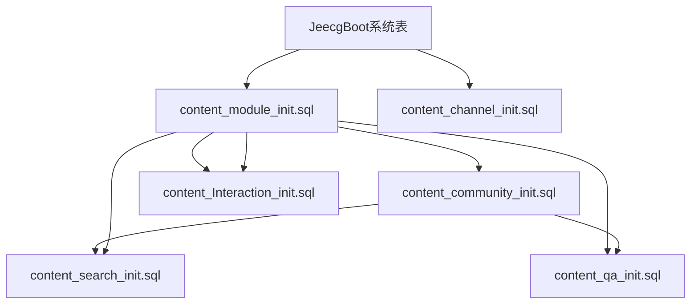

# 内容社区系统数据库初始化脚本使用说明

## 📋 概述

本文档详细说明了内容社区系统数据库初始化脚本的使用方法、依赖关系和注意事项。

## 📁 脚本文件清单

| 脚本文件 | 功能描述 | 执行顺序 |
|---------|---------|---------|
| `content_init_master.sql` | 主初始化脚本，统一管理所有模块初始化 | 1 |
| `content_dependency_check.sql` | 依赖关系检查脚本，验证前置条件 | 可选 |
| `content_rollback.sql` | 回滚脚本，清理所有内容模块数据 | 回滚时 |
| `content_module_init.sql` | 核心内容模块初始化 | 2 |
| `content_community_init.sql` | 社区模块初始化 | 3 |
| `content_qa_init.sql` | 问答模块初始化 | 4 |
| `content_Interaction_init.sql` | 互动模块初始化 | 5 |
| `content_channel_init.sql` | 频道模块初始化 | 6 |
| `content_search_init.sql` | 搜索模块初始化 | 7 |

## 🚀 快速开始

### 1. 环境要求

- **数据库版本**: MySQL >= 5.7 或 MariaDB >= 10.2
- **字符集**: UTF8MB4
- **权限要求**: 
  - CREATE, DROP, ALTER 表权限
  - CREATE, DROP 存储过程权限
  - CREATE, DROP 视图权限
  - INSERT, UPDATE, DELETE, SELECT 数据权限

### 2. 前置条件检查

在执行初始化前，请确保：

```sql
-- 检查MySQL版本
SELECT VERSION();

-- 检查字符集设置
SHOW VARIABLES LIKE 'character_set%';

-- 检查JeecgBoot系统表是否存在
SHOW TABLES LIKE 'sys_user';
```

### 3. 执行初始化

#### 方式一：使用主脚本（推荐）

```bash
# 进入MySQL命令行
mysql -u username -p database_name

# 执行主初始化脚本
source /path/to/content_init_master.sql;
```

#### 方式二：逐个执行

```sql
-- 1. 执行依赖检查（可选）
source content_dependency_check.sql;
CALL check_all_dependencies();

-- 2. 按顺序执行各模块脚本
source content_module_init.sql;
source content_community_init.sql;
source content_qa_init.sql;
source content_Interaction_init.sql;
source content_channel_init.sql;
source content_search_init.sql;
```

## 🔗 模块依赖关系



### 详细依赖说明

1. **content_module_init.sql** (核心模块)
   - 依赖：`sys_user` 表
   - 提供：`contents`, `media_files` 等基础表

2. **content_community_init.sql** (社区模块)
   - 依赖：`contents`, `sys_user` 表
   - 提供：`communities`, `user_profile_extension` 等表

3. **content_qa_init.sql** (问答模块)
   - 依赖：`contents`, `communities`, `user_profile_extension` 表

4. **content_Interaction_init.sql** (互动模块)
   - 依赖：`contents`, `media_files` 表

5. **content_channel_init.sql** (频道模块)
   - 依赖：`sys_user` 表（相对独立）

6. **content_search_init.sql** (搜索模块)
   - 依赖：`contents`, `user_profile_extension`, `communities` 表

## 📊 执行监控

### 查看执行日志

```sql
-- 查看今日执行记录
SELECT 
    script_name as '脚本名称',
    CASE execution_status 
        WHEN 0 THEN '执行中'
        WHEN 1 THEN '成功'
        WHEN 2 THEN '失败'
    END as '执行状态',
    start_time as '开始时间',
    end_time as '结束时间',
    TIMESTAMPDIFF(SECOND, start_time, COALESCE(end_time, NOW())) as '耗时(秒)',
    error_message as '错误信息'
FROM content_init_log 
WHERE DATE(start_time) = CURDATE()
ORDER BY execution_order;
```

### 执行状态说明

- **0**: 执行中
- **1**: 执行成功
- **2**: 执行失败

## 🔍 依赖检查工具

### 执行全面检查

```sql
-- 加载检查脚本
source content_dependency_check.sql;

-- 执行所有依赖检查
CALL check_all_dependencies();

-- 检查数据完整性
CALL check_data_integrity();
```

### 单独检查模块

```sql
-- 检查特定模块依赖
CALL check_content_module_dependencies();
CALL check_content_community_dependencies();
CALL check_content_qa_dependencies();
CALL check_content_interaction_dependencies();
CALL check_content_channel_dependencies();
CALL check_content_search_dependencies();
```

## 🗂️ 数据库表结构概览

### 核心内容模块 (content_module_init.sql)

| 表名 | 功能 | 记录数预估 |
|------|------|-----------|
| `contents` | 核心内容表 | 10万+ |
| `media_files` | 媒体文件表 | 5万+ |
| `content_media_relations` | 内容媒体关联表 | 20万+ |
| `content_tags` | 内容标签表 | 1000+ |
| `content_topics` | 内容话题表 | 500+ |
| `polls` | 投票表 | 1万+ |

### 社区模块 (content_community_init.sql)

| 表名 | 功能 | 记录数预估 |
|------|------|-----------|
| `communities` | 社区表 | 1000+ |
| `user_profile_extension` | 用户资料扩展表 | 10万+ |
| `community_members` | 社区成员表 | 50万+ |
| `community_announcements` | 社区公告表 | 5000+ |

### 互动模块 (content_Interaction_init.sql)

| 表名 | 功能 | 记录数预估 |
|------|------|-----------|
| `content_likes` | 点赞表 | 100万+ |
| `content_comments` | 评论表 | 50万+ |
| `content_favorites` | 收藏表 | 20万+ |
| `content_shares` | 分享表 | 10万+ |

## 🔄 回滚操作

### 完全回滚

```sql
-- 执行完整回滚（谨慎使用！）
source content_rollback.sql;
```

### 部分回滚

```sql
-- 手动删除特定模块的表
-- 例如：只删除搜索模块
DROP TABLE IF EXISTS search_statistics;
DROP TABLE IF EXISTS search_templates;
-- ... 其他搜索相关表
```

## ⚠️ 注意事项

### 执行前必读

1. **数据备份**: 执行前务必备份数据库
2. **环境隔离**: 建议先在测试环境验证
3. **权限确认**: 确保数据库用户有足够权限
4. **依赖检查**: 执行前运行依赖检查脚本

### 常见问题

#### 1. 执行失败：表已存在

```sql
-- 解决方案：清理已存在的表
DROP TABLE IF EXISTS table_name;
-- 或者使用回滚脚本
source content_rollback.sql;
```

#### 2. 外键约束错误

```sql
-- 临时禁用外键检查
SET FOREIGN_KEY_CHECKS = 0;
-- 执行脚本
source content_init_master.sql;
-- 恢复外键检查
SET FOREIGN_KEY_CHECKS = 1;
```

#### 3. 字符集问题

```sql
-- 设置正确的字符集
SET NAMES utf8mb4;
ALTER DATABASE database_name CHARACTER SET utf8mb4 COLLATE utf8mb4_unicode_ci;
```

#### 4. 权限不足

```sql
-- 检查当前用户权限
SHOW GRANTS FOR CURRENT_USER();

-- 授予必要权限（需要管理员执行）
GRANT CREATE, DROP, ALTER, INSERT, UPDATE, DELETE, SELECT ON database_name.* TO 'username'@'host';
```

## 📈 性能优化建议

### 1. 索引优化

脚本已包含必要的索引，但可根据实际使用情况调整：

```sql
-- 查看索引使用情况
SHOW INDEX FROM contents;

-- 分析慢查询
SHOW PROCESSLIST;
```

### 2. 分区建议

对于大表可考虑分区：

```sql
-- contents表按时间分区示例
ALTER TABLE contents PARTITION BY RANGE (YEAR(create_time)) (
    PARTITION p2023 VALUES LESS THAN (2024),
    PARTITION p2024 VALUES LESS THAN (2025),
    PARTITION p_future VALUES LESS THAN MAXVALUE
);
```

### 3. 配置优化

```sql
-- 调整相关配置
SET innodb_buffer_pool_size = '2G';
SET max_connections = 1000;
```

## 🛠️ 维护操作

### 定期维护脚本

```sql
-- 清理过期日志
DELETE FROM content_init_log WHERE create_time < DATE_SUB(NOW(), INTERVAL 30 DAY);

-- 更新统计信息
ANALYZE TABLE contents, communities, user_profile_extension;

-- 优化表
OPTIMIZE TABLE contents, content_comments, content_likes;
```

### 监控脚本

```sql
-- 检查表大小
SELECT 
    table_name,
    ROUND(((data_length + index_length) / 1024 / 1024), 2) AS 'Size (MB)'
FROM information_schema.tables 
WHERE table_schema = DATABASE()
AND table_name LIKE 'content%'
ORDER BY (data_length + index_length) DESC;
```

## 📞 技术支持

如遇到问题，请提供以下信息：

1. MySQL版本信息
2. 执行的具体脚本
3. 完整的错误信息
4. content_init_log表的相关记录

## 📝 更新日志

| 版本 | 日期 | 更新内容 |
|------|------|----------|
| 1.0.0 | 2024-01-15 | 初始版本，包含所有基础功能 |

---

**重要提醒**: 本脚本涉及数据库结构变更，请在生产环境使用前充分测试！