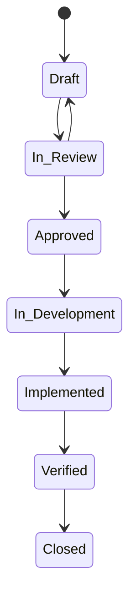

编写一份**Wiki风格的需求文档**，核心在于利用超链接、层级目录和模板，把分散的需求条目编织成一张可导航的知识网。相比线性文档，它更强调**结构化、关联性**和**持续演进**。

下面是一份完整的指南，包含域层级示例、上层对下层的引用方式，以及必备要素清单。

---

### 一、核心概念：需求域层级

“需求域”是对需求进行逻辑分组的一种维度，可以让不同角色快速定位。一个典型的层级结构如下（以电商系统为例）：

| 层级 | 命名示例                  | 说明 | Wiki页面类型 |
|------|-----------------------|------|--------------|
| L0 | 业务域 `Business Domain` | 最高级分类，对应核心业务能力 | 分类页(Category) |
| L1 | 功能域 `Epic Area`       | 一个独立的业务模块或子系统 | 主题页/总览页 |
| L2 | 特性 `Feature`          | 一个完整的用户故事或功能点 | 独立需求页 |
| L3 | 需求条目 `Requirement`    | 可测试、可验证的单条需求 | 段落/锚点或子页面 |

**树状结构示例：**
```
订单域 (Order Domain)                      ← L0 分类页
└── 订单创建能力 (Order Creation)           ← L1 功能域总览页
    ├── 购物车管理 (Cart Management)        ← L2 特性页
    │   ├── REQ-CART-001 添加商品到购物车   ← L3 需求条目
    │   └── REQ-CART-002 合并登录前后购物车
    └── 结算与下单 (Checkout)               ← L2 特性页
        └── REQ-CHK-001 使用优惠券结算
```

---

### 二、上层对下层的引用方式

在Wiki系统（如Confluence、Notion、MediaWiki）中，**上层对下层的引用**不仅是文档中的链接，更是**结构约束和上下文继承**。主要通过以下4种机制实现：

#### 1. 面包屑导航与父页面声明
每个子页面顶部自动生成或手动写入父级链接，明确“我从哪里来”。
```markdown
父页面: [订单创建能力] > [购物车管理]
```
在Confluence中，这由内置的“子页面列表”宏和面包屑自动完成；在Notion中，数据库的“关系”属性或面包屑会显示层级。

#### 2. 父级概要中的“子需求索引”
在L2特性页`购物车管理`中，用动态查询或手动链接列出所有L3子条目：
```markdown
## 包含的需求条目
- [[REQ-CART-001]] 添加商品到购物车
- [[REQ-CART-002]] 合并登录前后购物车
```
**这是最直接的“上层引用下层”体现**，确保父页成为该特性的唯一入口与目录。

#### 3. 属性继承与策略声明
父级页面会声明本域内所有子需求必须遵守的共同规则，下层需求通过**引述（transclusion）或链接**来继承。
```markdown
> 本条需求遵循 [订单域全局非功能需求] 中的性能指标：
> * 购物车接口 P95延迟 < 200ms
> * 强一致性要求
```

#### 4. 反向链接（双向引用）
Wiki的“反向链接”功能是关联的灵魂。在每个L3需求页底部，会自动显示“哪些页面链接到了这里”，从而让下层条目明确看到自己被哪些上层设计、测试用例所引用。

---

### 三、必备要素清单

一套完整的Wiki风格需求文档体系，必须包含以下要素，才能实现可追溯、可维护、可协作。

#### 1. 结构化模板
为不同层级创建标准模板，保证一致性。
- **L2 特性页模板：**
  - **背景与目标** (为什么做)
  - **范围界定** (做什么，明确不做what)
  - **业务规则** (计算逻辑、约束)
  - **子需求索引** (自动子页面列表)
  - **交互原型/线框图链接**
  - **关联文档** (关联的UX设计、API文档、测试用例)
- **L3 需求条目模板：**
  - **需求ID** (不可变，唯一标识)
  - **父级功能** (链接到L2页面)
  - **标题** (动宾结构，如“用户可以添加商品到购物车”)
  - **详细描述** (含验收标准)
  - **优先级** (MoSCoW或高/中/低)
  - **来源/提出者**
  - **变更记录** (日期、变更内容、责任人)

#### 2. 唯一标识符系统
每个需求条目必须有全局唯一的ID（如 `REQ-购物车-001`），贯穿需求、设计、开发和测试。它是实现端到端追溯性的基石。

#### 3. 明确的验收标准
每条需求必须包含可测试的验收标准，使用场景化（Given-When-Then）或检查项列表形式。

#### 4. 属性标签体系
为页面打上多维标签（Labels/Tags），实现对需求的多维切片和筛选。必须覆盖：
- **需求类型**：`functional` `non-functional` `ui` `data` `business-rule`
- **状态**：`draft` `reviewed` `approved` `implemented` `deprecated`
- **优先级**：`p0-critical` `p1-high` `p2-medium`
- **版本/迭代**：`v1.0` `sprint-5`
- **模块/组件**：对应开发团队划分

#### 5. 关联链路与矩阵
利用Wiki的链接和数据库功能，显式建立以下关联：
- **需求-需求**：父子依赖、冲突、互斥
- **需求-设计**：需求页链接到UI设计稿、API接口文档
- **需求-测试**：需求页链接到对应的测试用例（或直接在页内嵌入测试用例摘要）
- **需求-缺陷**：需求上线后，关联的Bug报告

#### 6. 状态机与生命周期管理
定义需求的状态流转，并在页面顶部显示当前状态。

状态变更时，通过评论或标签更新，并可选自动通知订阅者。

#### 7. 非功能需求全局页
建立一个独立页面统一定义全局非功能需求（性能、安全、可用性等），各功能域需求页面通过引用来遵循，避免重复。

#### 8. 术语表/词汇表
一个独立的Wiki页面，统一定义业务术语（如“用户”“订单状态”）。所有需求页面中出现的术语均可链接到术语表，消除歧义。

#### 9. 版本与变更日志
每个需求页面应通过Wiki自带的“页面历史”保留版本。重大变更需在页面底部的“变更记录”表格中显式写出，并关联变更请求（如“因CR-2024-001变更”）。

#### 10. 协作与通知机制
- **内联评论**：对特定需求条目进行讨论，决策过程留痕。
- **@提醒**：在评审或变更时通知相关人。
- **观察者**：使关键干系人能自动收到该需求页面的所有后续变更通知。

---

### 四、一个页面的完整示例骨架

以L2特性页面`购物车管理`为例：

```markdown
---
标签: functional, p0-critical, v2.0, cart-module
父页面: [订单创建能力]
状态: approved
---

# 购物车管理

## 目标与背景
用户可以将待购商品暂存至购物车，并跨会话保持。

## 范围
- **包含**：添加/删除/修改数量、多端合并、库存校验
- **不包含**：... (省略)

## 全局约束引用
本特性下的所有需求条目，必须满足 **[全局非功能需求]** 中的：
- 所有API P95 < 200ms
- 用户操作需埋点上报...

## 子需求列表 (上层对下层的索引)
- [[REQ-CART-001]] 添加商品到购物车
- [[REQ-CART-002]] 用户可修改商品数量
- [[REQ-CART-003]] 清空失效商品

## 业务规则
- 商品加入购物车时，仅校验库存展现，不锁定。
- 生成订单时才进行真正的库存预占。

## 相关设计
- [购物车原型图v2.0]
- [购物车API设计]

## 变更记录
| 日期 | 变更内容 | 责任人 |
|------|-------|--------|
| 2026-01-15 | 创建页面 | PM_张三 |
```

在这个示例中，**标签、父页面、子需求列表、全局约束引用、状态**等必备要素全部落地，并且通过`子需求列表`实现了上层对下层的清晰索引。