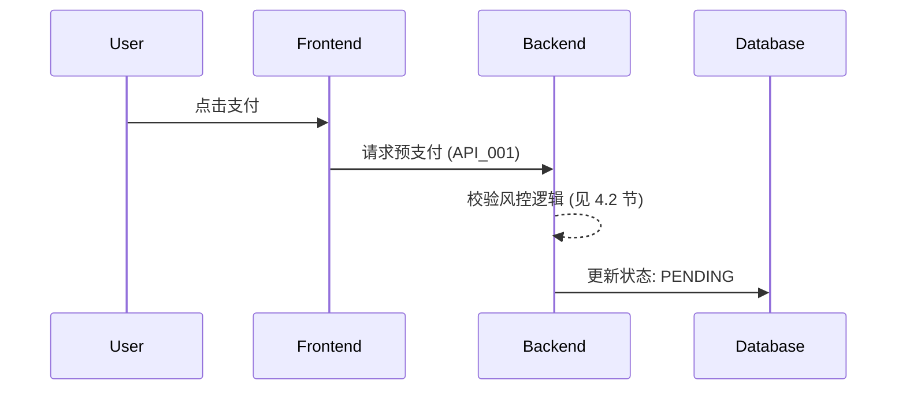

既然文档的最终目标是为 **Agent (AI Coding Assistant)** 提供上下文，那么文档的编写逻辑必须从“人类阅读习惯”转向**“结构化机器理解”**。Agent 需要极其明确的定义、强逻辑的引用链条以及消除歧义的边界条件。

以下是针对 Agent Code 开发优化的 Wiki 风格 PRD 最终详细内容框架。

---

## 一、 文档组织架构 (Wiki Structure)

建议采用 **“1 + N + M”** 的目录结构，利用 Markdown 的层级链接实现 Agent 的上下文自动索引：

*   **[L1] 00_Index (全局地图):** 包含项目背景、技术栈声明、业务全局变量、外部依赖 API 列表。
*   **[L2] 01_Module_Core (核心模块):** 描述业务逻辑实体（Entity）及其生命周期（State Machine）。
*   **[L3] 02_Function_Details (原子需求):** 具体的接口协议、前端交互规则、算法逻辑。

---

## 二、 针对 Agent 优化的 5 大补充要素

为了让 Agent 读完 PRD 就能写出高可读、少 Bug 的代码，必须补充以下元素：

### 1. 领域模型定义 (Domain Entity / Schema)
Agent 往往不清楚数据库字段的业务含义。
*   **要素：** 提供数据库实体（Entity）或 DTO 的伪代码定义。
*   **作用：** 消除 Agent 瞎起字段名、类型定义错误的风险。

### 2. 状态机与生命周期 (State Machine)
对于订单、工作流等逻辑，Agent 最容易在状态跳转上出错。
*   **要素：** 明确 `Status_A` -> `Action` -> `Status_B` 的转换矩阵。
*   **作用：** Agent 可以根据此矩阵生成校验代码。

### 3. 全局异常处理表 (Exception Matrix)
*   **要素：** 定义全局错误码（ErrorCode）及对应的处理策略（重试、弹窗、静默、降级）。
*   **作用：** 确保 Agent 生成的 Try-Catch 逻辑符合项目规范。

### 4. 业务约束与断言 (Business Constraints/Assertions)
*   **要素：** 显式声明不可违反的原则。例如：“订单金额永远不能为负”、“用户年龄必须在 0-150 之间”。
*   **作用：** 方便 Agent 编写单元测试用例。

### 5. 存量代码上下文引用 (Existing Context Reference)
*   **要素：** 明确指出“此功能参考 `AbstractService.java` 的实现方式”或“UI 规范遵循 `AntDesign 5.0`”。
*   **作用：** 强制 Agent 遵循现有的代码风格，避免“屎山”堆积。

---

## 三、 最终详细内容模板 (Markdown Final Version)

```markdown
# [Project Name] 需求规格说明书 (PRD)

## 0. 文档上下文 (Agent Context)
- **技术栈:** Java 21 / Spring Boot 3 / MyBatis-Plus / React 18 / TS
- **核心路径:** `com.company.project.module.*`
- **依赖引用:** [[00_Global_Schema]] | [[01_API_Specifications]]

---

## 1. 业务目标与逻辑视图
### 1.1 业务蓝图
> 此功能属于 [L1_史诗层级]，主要解决用户支付时的资金安全问题。

### 1.2 核心流程图 (Mermaid)


---

## 2. 需求定义 (Requirement Hierarchy)

### 2.1 [L2_特性层]：支付中心重构
| 编号 | 需求名称 | 关联子页面 (L3) | 状态 |
| :--- | :--- | :--- | :--- |
| FR-01 | 账户余额实时校验 | [[Detail_Balance_Check]] | 🏗️ |
| FR-02 | 异常状态回滚逻辑 | [[Detail_Rollback_Logic]] | 🏗️ |

---

## 3. 功能详细说明 (Atomic Details)

### 3.1 实体模型 (Data Schema)
```typescript
/** @model AccountBalance */
interface AccountBalance {
  userId: string; // 唯一用户ID，关联 User 表
  balance: number; // 余额，精度保留2位小数
  currency: 'CNY' | 'USD'; // 枚举值：币种
}
```

### 3.2 业务断言 (Assertions)
1. **[A-1]** 支付金额 `amount` 必须严格等于 `item_price * quantity`。
2. **[A-2]** 支付过程中如果余额扣减失败，必须抛出 `BalanceInsufficientException` 并触发事务回滚。

### 3.3 状态流转规则 (FSM)
- `INIT` -> `PAYING`: 调用支付接口。
- `PAYING` -> `SUCCESS`: 支付回调成功。
- `PAYING` -> `FAILED`: 支付失败或超时。

---

## 4. 接口协议与交互 (Interface)

### 4.1 核心 API 定义
- **Endpoint:** `POST /v1/payment/execute`
- **Request Body:**
  ```json
  { "orderId": "string", "payType": "enum" }
  ```
- **Error Codes:**
  - `4001`: 余额不足（UI处理：跳转充值）
  - `4002`: 重复支付（UI处理：提示并跳转订单页）

### 4.2 埋点与监控
- **Event:** `order_paid_event`
- **Properties:** `order_id`, `amount`, `source_channel`

---

## 5. 验收标准 (Definition of Done)
- [ ] 代码通过 CheckStyle 规范扫描。
- [ ] 核心业务逻辑单元测试覆盖率 > 80%。
- [ ] 边界测试：余额为 0、网络超时 5s 的异常处理。
```

---

### 给 Agent 的提示词建议（结合 Wiki 使用）
当你将上述文档喂给 Agent 时，请加上这句话：
> “请参考以上 Wiki 格式的需求文档。特别注意其中的 **‘业务断言’** 和 **‘状态流转规则’**。在编写代码时，请确保实体字段名与文档定义的 **Schema** 保持一致，并严格遵循 **ErrorCode** 处理矩阵。”